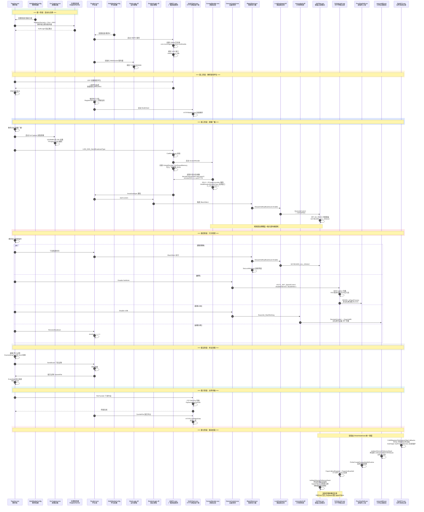

# Os-Easy 电子教室 完整运行流程图



---

## 图例说明

| 颜色 | 阶段 |
|---|---|
| 🟢 绿色 | 启动与注册 |
| 🟠 橙色 | 教师发现学生 |
| 🔵 蓝色 | 屏幕广播（核心） |
| 🔴 红色 | 行为管控 |
| ⬜ 灰色 | 考试流程 |
| 🩵 青色 | 文件传输 |
| 🩷 粉色 | 驱动安装 |

## 组件分组

```
┌─────────────────────────────┐
│  教师端                      │
│  Teacher + ScrCapture + Cfg │
└──────────┬──────────────────┘
           │ 注册服务器 / UDP组播
           ▼
┌─────────────────────────────┐
│  MMPC 服务（广播调度中枢）     │
└──────────┬──────────────────┘
           │ 共享内存 / 进程拉起
           ▼
┌─────────────────────────────┐
│  学生端用户态                 │
│  Student → MultiClient      │
│  ScreenRender → BlackSlient │
│  DeviceControl              │
└──────────┬──────────────────┘
           │ DeviceIoControl
           ▼
┌─────────────────────────────┐
│  内核驱动层                   │
│  KbFilter | OeNetLimit      │
│  easyusbflt | ProcFireWall  │
│  FbdATS                     │
└─────────────────────────────┘
```
