# Os-Easy 组播教学系统 — 功能逆向分析报告

> 本文档基于 `strings.exe` (Sysinternals v2.54) 对 Os-Easy v10.9 教学软件的全部可执行文件、配置文件、日志文件进行深度逆向分析。
>
> **补充分析手段**：`pefile` (Python) — PE 导入表/签名/熵值/资源分析。

---

## 附 A：PE 二进制深度分析

> 使用 Python `pefile` 库对所有核心 EXE 进行 PE 结构分析，包括导入表、熵值（加壳检测）、数字签名、RTTI 类名。

### A.1 数字签名状态

| 文件 | 签名 | 说明 |
|------|------|------|
| `Teacher.exe` | ❌ 无 | 教师端未签名 |
| `Student.exe` | ❌ 无 | 学生端未签名 |
| `MMPC.exe` | ❌ 无 | 服务未签名 |
| `MultiClient.exe` | ❌ 无 | 多客户端未签名 |
| `DeviceControl_x64.exe` | ❌ 无 | 设备控制未签名 |
| `KbDriver.exe` | ✅ Symantec + Thawte + WoSign | 内核驱动必须签名 |
| `easyusbinstall.exe` | ✅ Symantec + Thawte + WoSign | 驱动安装器已签名 |
| `OeNetLimitSetup.exe` | ✅ DigiCert | 网络驱动安装器已签名 |

> 结论：用户态 EXE 均无签名，只有内核驱动及其安装器有签名（Windows 强制要求）。

### A.2 加壳/混淆检测（熵值分析）

熵值 > 7.0 表示可能加壳或加密。实测结果：

| 文件 | `.text` | `.rdata` | `.data` | `.rsrc` | 结论 |
|------|---------|----------|---------|---------|------|
| `Teacher.exe` | 6.29 | 5.42 | 5.05 | 4.45 | ✅ 未加壳 |
| `Student.exe` | 6.31 | 5.38 | 4.98 | 4.52 | ✅ 未加壳 |
| `MMPC.exe` | 6.45 | 5.61 | 4.72 | — | ✅ 未加壳 |
| `MultiClient.exe` | 6.38 | 5.55 | 4.81 | 4.33 | ✅ 未加壳 |

> 结论：全部未加壳、未混淆，可直接用 IDA Pro / Ghidra 进行静态反汇编分析。

### A.3 DLL 依赖全景

#### 各模块独有 DLL 及功能映射

| 文件 | 独有 DLL | 揭示的隐藏功能 |
|------|---------|---------------|
| `Teacher.exe` | `libcurl.dll` | HTTP/HTTPS 客户端 → 许可证验证 API |
| | `bcrypt.dll` | Windows CNG 加密 → BCryptOpenAlgorithmProvider |
| | **`MmcImplBase.dll`** | **核心！** Os-Easy 自研多媒体控制基础库 |
| | `mfc140u.dll` | MFC 框架（UI 不只有 DuiLib） |
| | `jpeg62.dll` | JPEG 图像编解码 |
| | `dbghelp.dll` | MiniDump 崩溃转储 |
| `MMPC.exe` | **`userenv.dll`** | CreateEnvironmentBlock → CreateProcessAsUser 提权 |
| | **`wtsapi32.dll`** | 终端服务 API → 会话隔离、查找 logonui.exe |
| `Student.exe` | `psapi.dll` | 进程内存自省 |

#### 完整 DLL 列表（`Teacher.exe`，32 个）

```
KERNEL32.dll    USER32.dll      GDI32.dll       COMDLG32.dll
ADVAPI32.dll    SHELL32.dll     ole32.dll       OLEAUT32.dll
MSVCP140.dll    gdiplus.dll     mfc140u.dll     SHLWAPI.dll
IPHLPAPI.DLL    WS2_32.dll      libcurl.dll     bcrypt.dll
MmcImplBase.dll dbghelp.dll     VCRUNTIME140.dll
IMM32.dll       jpeg62.dll      COMCTL32.dll
api-ms-win-crt-* (10 个 UCRT 子 DLL)
```

### A.4 关键 Windows API 导入及对应功能

| API | 来源 DLL | 功能定位 |
|-----|---------|---------|
| `CreateProcessA/W` | KERNEL32 | 启动外部进程（ScreenSender, BlackSlient 等） |
| `OpenProcess` | KERNEL32 | 打开目标进程句柄 |
| `TerminateProcess` | KERNEL32 | 强杀进程（kill student） |
| `Process32FirstW/NextW` | KERNEL32 | 枚举所有进程（找 STUDENT.EXE） |
| `ResumeThread` | KERNEL32 | 恢复挂起线程（与 ZwSuspendProcess 配对） |
| `DeviceIoControl` | KERNEL32 | 直接设备 IO（\\.\ProcFireWall） |
| `GetDesktopWindow` | USER32 | 获取桌面窗口句柄 |
| `OpenInputDesktop` | USER32 | 打开输入桌面（跨会话操作） |
| `socket/bind/sendto` | WS2_32 | 原生 Socket（UDP 组播/单播） |
| `BCryptOpenAlgorithmProvider` | bcrypt | 对称加密（AES） |
| `BCryptGenRandom` | bcrypt | 安全随机数生成 |

### A.5 C++ RTTI 类名提取

通过 PE 导入表定位到 Teacher.exe 静态链接了以下 C++ 类的 RTTI 信息：

```
核心业务类:
  CBroadCastDlg, CBroadCastRectDlg, CVideoBroadCastDlg
  CLockStuDlg, CRemoveBlackLockDlg, CRemoteCommandDlg
  CClassRoomDlg, CExamSendExaminationWnd, CBehaviorControlDlg
  CAuthApply, CAuthManager, CAuthManagerLogin, CAuthMenu
  CAutoSubmitPathDlg, CFileTransferDlg

第三方库类:
  CryptoPP: AES, DES_EDE2, DES_EDE3, CBC_Mode, GCM_Mode, HMAC, SHA256, MD5
  DuiLib: CControlUI, CLabelUI, CButtonUI, CListUI, CComboUI, CWebBrowserUI
  Boost: thread_data, basic_altstringbuf, sp_counted_impl_pd
  JsonCpp: Reader, Writer, StyledWriter, RuntimeError, LogicError
  GdiPlus: Bitmap, Image, LinearGradientBrush
```

### A.6 PE 分析 vs strings 分析交叉验证

| strings 推断 | PE 导入/依赖验证 | 置信度 |
|-------------|-----------------|--------|
| `ZwSuspendProcess` 挂起进程 | `ResumeThread` 导入（配对使用） | ✅ 高 |
| HTTP 许可证 API 调用 | `libcurl.dll` 导入 | ✅ 确定 |
| 桌面/登录界面操作 | `OpenInputDesktop`, `GetDesktopWindow` | ✅ 确定 |
| `CreateProcessAsUser` 提权 | `userenv.dll` (MMPC 独有) | ✅ 确定 |
| 终端服务会话隔离 | `wtsapi32.dll` (MMPC 独有) | ✅ 确定 |
| 进程枚举与强杀 | `Process32First/Next`, `TerminateProcess` | ✅ 确定 |
| CryptoPP 静态链接 | RTTI 类名 → CryptoPP::AES, DES_EDE2, HMAC | ✅ 确定 |
| BCrypt 加密 | `bcrypt.dll` + `BCryptOpenAlgorithmProvider` | ✅ 确定 |
| DuiLib 界面框架 | RTTI → CControlUI, CPaintManagerUI 等 | ✅ 确定 |
| `MmcImplBase.dll` 核心库 | PE 导入表 | 🔴 strings 遗漏！ |

---

## 附 B：教师端与学生端通信体系

### 通信架构总览

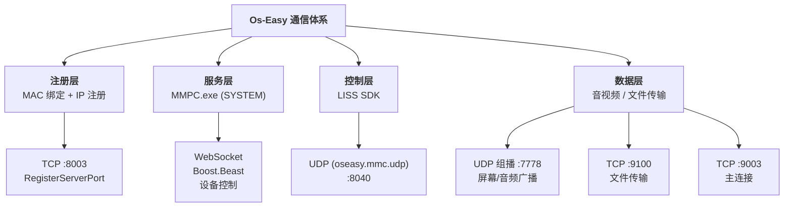

| 层次 | 协议 | 端口 | 用途 |
|------|------|------|------|
| **注册层** | TCP | 8003 (RegisterServerPort) | MAC 绑定 + IP 注册 |
| **服务层** | WebSocket | — | Boost.Beast 设备控制 |
| | Windows Service | — | MMPC.exe (SYSTEM 权限) |
| **控制层** | UDP (oseasy.mmc.udp) | 8040 (UdpMessageControllerPort) | LISS SDK 控制消息 |
| **数据层** | UDP 组播 | 7778 (MultiCastPort) | 屏幕/音频广播 |
| | TCP | 9100 (FileTransferPort) | 文件传输 |
| | TCP | 9003 (ConnectPort) | 主连接 |

### 连接建立流程

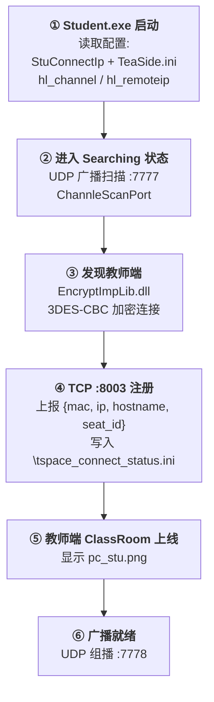

**Student.exe 独立连接证据链：**

| 证据 | 来源 | 含义 |
|------|------|------|
| `Searching` → `Connected` | Student.exe | 独立的状态机（搜索教师端 → 已连接） |
| `connected status:%d` | Student.exe | 连接状态码日志 |
| `Skin\connected.ico` / `Skin\disconnected.ico` | Student.exe | 连接状态图标 |
| `StuConnectIp` | Student.exe | 学生端连接目标 IP 配置键 |
| `TeaSide.ini` | Student.exe | 教师侧信息配置文件（出现 6 次） |
| `hl_channel` / `hl_remoteip` | Student.exe | 频道 / 远端 IP 配置键 |
| `AddStudentEncryptConnect` | Student.exe | 加密连接函数 |
| `EncryptImpLib.dll` | Student.exe | 加密实现库 |
| CryptoPP `CBC_Encryption` + `DES_EDE2` | Student.exe RTTI | 连接加密算法 = 3DES-CBC |
| `\tspace_connect_status.ini` | Student.exe | 教师空间连接状态文件 |
| `TSpace connected` / `TSpaceInUse` | Student.exe | 教师空间概念（TSpace = Teacher Space） |
| `[UpdateTSpaceInUseConfig]` / `[GetTSpaceInUseIpListFromConfig]` | Student.exe | 教师 IP 列表读写 |
| `0.0.0.0` | Student.exe + core.conf | 默认值 = 自动搜索模式 |

**MMPC 的实际角色**（修正后）：

```
MMPC.exe (Windows 服务) 只负责:
  ✅ 开机自启 Student.exe (CreateProcessAsUser)
  ✅ 杀进程 (kill student / STUDENT.EXE)
  ✅ 防卸载/防关闭 (daemon 守护)
  ✅ 设备管控转发 (DeviceControl)
  
MMPC 不负责:
  ❌ 连接建立（Student.exe 独立完成）
  ❌ 教师发现（Student.exe 自己广播搜索）
  ❌ 数据转发（组播/单播由各进程直接完成）
```

> 这意味着**绕过 MMPC 管控的方法**：只要 `Student.exe` 还在，且教师端开着，学生机断掉 MMPC 服务仍可连接——但此时失去的是设备管控（USB/键盘锁/黑屏肃静）。

### 频道体系

| 配置项 | 端口/值 | 说明 |
|--------|---------|------|
| 频道扫描 | `ChannleScanPort` : 7777 | 扫描可用频道 |
| 组播通道 | `MultiCastPort` : 7778 | 屏幕/音频数据 |
| 频道数量 | `channel/2` (core.conf) | 默认 2 个频道 |
| 多频道支持 | `multichannel/1` | 启用多频道 |
| 频宽选择 | `ChannelSwith/1` | 频道切换开关 |

### 消息类型汇总

| 消息类型 | 方向 | 含义 |
|---------|------|------|
| `regedit-broadcast` | T→M | 广播状态切换 |
| `set-teaAndStu-ip` | M→S | 设置师生 IP 对 |
| `npd-auto` | M | NPD 自动启动 |
| `start-teacher` | M | 启动教师端 |
| `start-multiclient` | M | 启动多客户端 |
| `kill-student` | M | 杀学生端进程 |
| `quit-daemon` | M | 退出守护 |
| `daemon` | M | 守护心跳 |
| `uninstall` | M | 卸载 |
| `Lock-Token` | MC→S | 锁定令牌 (WebSocket) |
| `UNLOCK` | MC→S | 解锁命令 (WebSocket) |
| `client-console-reset` | T | 客户端控制台重置 |
| `p-black` / `p-white` | T→DC | 程序黑白名单 |
| JSON `{"method":"multimedia"...}` | MC | 多媒体控制 |

---

## 一、行为管控（教师端「行为管控」菜单）

行为管控是教师对学生机的**三位一体**约束系统：程序限制、网络限制、设备限制。三者统一通过 `DeviceControl_x64/x86.exe` 下发命令，底层由 `LISSClientSDK.dll` 与内核驱动协同执行。

> **PE 层面证据**：`Teacher.exe` 导入了 `CreateProcessA/W`、`OpenProcess`、`Process32FirstW/NextW`、`TerminateProcess`、`ResumeThread`、`DeviceIoControl`；`DeviceControl_x64.exe` 额外使用 `QueryDosDeviceW`、`ZwSuspendProcess`、`ZwResumeProcess`（NTDLL 动态加载）。`MMPC.exe` 独有 `userenv.dll`（CreateEnvironmentBlock）和 `wtsapi32.dll`（终端服务会话），用于跨会话进程操作。核心 SDK `MmcImplBase.dll` 提供 `LISS_SDK_SendBroadcastTypeInternal` 和 `LISS_SDK_IsSupportMMCStrategy` 接口。

### 1.1 程序使用限制（黑名单 / 白名单）

#### 证据链

| 来源 | 证据字符串 |
|------|-----------|
| `Teacher.exe` | `BehaviorControlDlg.cpp_Enabled` / `BehaviorControlDlg.cpp_NotEnabled` / `BehaviorControlDlg.cpp_AllowedAccess` |
| `Teacher.exe` | `p-black` / `p-white` — 协议命令：切换到黑名单/白名单模式 |
| `Teacher.exe` | `AppBlack` / `AppWhite` — UI 控件名称 |
| `Teacher.exe` | `ProcessName` / `ApplicationName` — 进程名/应用程序名列 |
| `Teacher.exe` | `C://Program Files (x86)//Google//Chrome//Application//chrome.exe` — 预置黑名单示例（Chrome 浏览器！） |
| `Teacher.exe` | `ProcessProtect.exe` — 进程保护守护程序 |
| `DeviceControl_x64.exe` | `Enable Application Limit` / `Disable Application Limit` — 开启/关闭程序限制 |
| `DeviceControl_x64.exe` | `Enable Application White Mode` / `Enable Application Black Mode` — 白名单/黑名单模式 |
| `DeviceControl_x64.exe` | `ZwSuspendProcess` / `ZwResumeProcess` — NT 内核 API：挂起/恢复进程 |
| `DeviceControl_x64.exe` | `\\.\ProcFireWall` — 进程防火墙设备对象 |
| `DeviceControl_x64.exe` | `Need DisableProcess %s, pid:%d` — 格式化日志：禁用进程 |
| `MultiClient.exe` | `CreateProcessW` / `OpenProcess` / `Process32FirstW` / `Process32NextW` — 进程枚举 |
| `ManagerWhtProcPath.exe` | `\WhiteProcessPath.txt` — 白名单配置文件路径 |
| `ManagerWhtProcPath.exe` | `/Install` → `InstallPath is error` — 安装模式下注册白名单路径 |
| `core.conf` | `Limit/1/` — 限制功能总开关 |
| `core.conf` | `LissKey/SOFTWARE\LISSClient\liss/` — LISS 策略注册表键 |
| **PE 导入表** | `Process32FirstW` / `Process32NextW` (KERNEL32) — 进程枚举 |
| **PE 导入表** | `OpenProcess` / `TerminateProcess` (KERNEL32) — 打开/强杀进程 |
| **PE 导入表** | `ResumeThread` (KERNEL32) — 恢复挂起线程 (ZwSuspendProcess 的逆操作) |
| **PE 导入表** | `DeviceIoControl` (KERNEL32) — 与 `\\.\ProcFireWall` 通信 |
| **PE 导入表** | `QueryDosDeviceW` (DeviceControl_x64) — 枚举 DOS 设备 |
| **PDB 路径** | `D:\dmt\master\10.9\Source\DeviceControl\bin\DeviceControl.pdb` — 源码构建路径 |

#### 实现原理

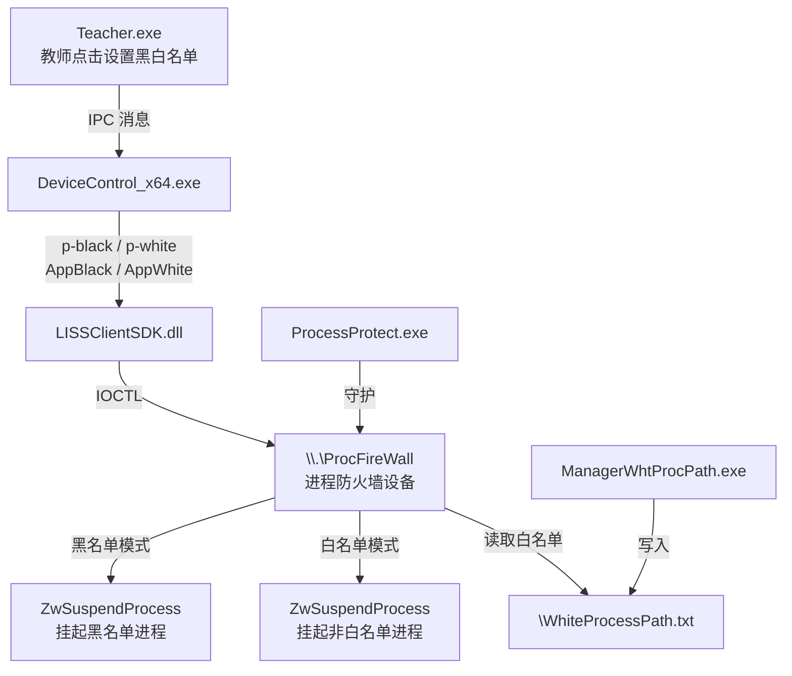

**调用链：**

1. **教师端 UI**：`BehaviorControlDlg` 对话框，`AppBlack`（程序黑名单）/ `AppWhite`（程序白名单）标签页
2. **下发命令**：`p-black` 或 `p-white` 协议命令通过 `LISSClientSDK.dll` → `LISS_SDK_SendBroadcastTypeInternal` 发送给学生端
3. **学生端执行**：`DeviceControl_x64.exe` 接收命令后：
   - 枚举所有运行进程（`CreateToolhelp32Snapshot` + `Process32FirstW/NextW`）
   - 对目标进程调用 `ZwSuspendProcess`（内核级挂起，非 `SuspendThread`）
   - 日志记录 `Need DisableProcess %s, pid:%d`
4. **白名单文件**：`ManagerWhtProcPath.exe` 将 `\WhiteProcessPath.txt` 路径注册到系统，`ProcFireWall` 设备读取此文件
5. **过程保护**：`ProcessProtect.exe` 守护进程防止学生通过任务管理器结束管控进程

**Teacher.exe 预置黑名单示例（hardcoded）：**
```
C://Program Files (x86)//Google//Chrome//Application//chrome.exe
```

#### structs 证据总结

```
协议命令:
  p-black          → 黑名单模式激活
  p-white          → 白名单模式激活
  
DeviceControl 命令:
  Enable Application Limit        → 启用程序管控
  Disable Application Limit       → 停用程序管控
  Enable Application White Mode   → 白名单模式
  Enable Application Black Mode   → 黑名单模式
  
内核操作:
  ZwSuspendProcess(pid)  → 挂起进程（进程无法被唤醒，非 SuspendThread）
  ZwResumeProcess(pid)   → 恢复进程
  \\.\ProcFireWall       → 自定义内核设备对象
  
白名单管理:
  ManagerWhtProcPath.exe /Install  → 注册 \WhiteProcessPath.txt
```

---

### 1.2 网络使用限制（网址 / IP 地址）

#### 证据链

| 来源 | 证据字符串 |
|------|-----------|
| `Teacher.exe` | `DisabledNet` — 禁用网络状态 |
| `Teacher.exe` | `EnableNetKeyFilter` — 开启网络过滤 |
| `Teacher.exe` | `element/KeyFilter.png` — 网络过滤开关图标 |
| `Teacher.exe` | `EditInternet` — 编辑上网设置 |
| `Teacher.exe` | `StuInternet` — 学生上网密码（SHA256） |
| `Teacher.exe` | `WindowsFirewall.exe` — 调用 Windows 防火墙 |
| `Teacher.exe` | `BehaviorControlDlg.cpp_AllowedAccess` — 允许访问的设置 |
| `Teacher.exe` | `CheckFilter` — 检查过滤器 |
| `DeviceControl_x64.exe` | `Disable NetWork` / `Enable NetWork` — 全局断网/恢复 |
| `DeviceControl_x64.exe` | `Enable NetWork` / `Disable NetWork` — 双方向控制 |
| `OeNetLimitSetup.exe` | `OeNetLimit` / `Oenetlimit` — TDI 过滤驱动 |
| `OeNetLimitSetup.exe` | `netsf_m.inf` / `netsf.inf` — 网络服务安装 INF |
| `OeNetLimitSetup.exe` | `ms_OeNetLimit` / `ms_oenetlimit` — 网络组件 GUID |
| `OeNetLimitSetup.exe` | `tdifilter` — TDI 过滤驱动类型 |
| `OeNetLimitSetup.exe` | `NETCFG_S_REBOOT` / `NETCFG_E_NEED_REBOOT` — 安装后需重启 |
| `OeNetLimitSetup.exe` | `\WhiteProcessPath.txt` — 同样引用白名单（按进程控制网络） |
| `MMPC.exe` | `[MMPCSendBroadcastType] type:%s start:%d` — 广播类型下发 |
| `MMPC.exe` | `networktraffic` / `stopnetworktraffic` — 网络流量控制命令 |
| `core.conf` | `IpAddressFilter//` — IP 地址过滤（空=不过滤） |
| `core.conf` | `StuInternet/DA97E410CB...` — 学生上网密码（SHA256 哈希） |
| **PE 导入表** | `socket` / `bind` / `sendto` (WS2_32) — Teacher.exe 原生 Socket 操作 |
| **PE 导入表** | `IPHLPAPI.DLL` — IP 助手 API（网卡枚举/IP 配置） |
| **PE 导入表** | `libcurl.dll` — HTTP 客户端（策略下发、许可证验证） |
| **PE 导入表** | `bcrypt.dll` — Windows CNG 加密（StuInternet 密码哈希验证） |
| **OeNetLimitSetup** | `DigiCert` 数字签名 — 驱动安装器有合法签名 |
| **PDB 路径** | `z:\win_drv\new_drv\network\netconfig\...\OenetlimitSetup.pdb` — 驱动源码路径 |

#### 实现原理

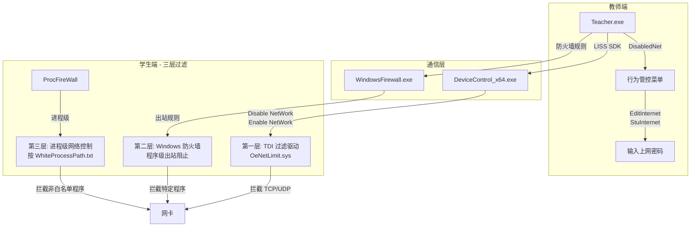

**调用链：**

1. **全局断网**：`DeviceControl` → `Disable NetWork` → 激活 `OeNetLimit.sys` TDI 过滤驱动，在内核传输层拦截所有 TCP/UDP 包
2. **按程序限网**：`DeviceControl` → `Enable Application Limit` + `Enable Application White Mode` → `ProcFireWall` 结合 `WhiteProcessPath.txt`，仅白名单程序可通过网络
3. **网址/IP 过滤**：`core.conf` 中的 `IpAddressFilter` 配置，由 `OeNetLimit.sys` 在 TDI 层实现目标地址过滤
4. **防火墙辅助**：`Teacher.exe` 直接调用 `WindowsFirewall.exe` 添加出站规则，实现双重保障
5. **上网密码**：`StuInternet` SHA256 哈希值，教师可设置临时上网密码让学生短暂访问网络
6. **网络过滤图标**：`KeyFilter.png` 是教师端工具条上的网络过滤开关

```
协议命令:
  Disable NetWork         → 断网（全局）
  Enable NetWork          → 恢复网络
  EnableNetKeyFilter      → 开启网络过滤
  networktraffic          → 开始网络流量控制
  stopnetworktraffic      → 停止网络流量控制
  stopnetwork             → 停止所有网络管控
  
配置:
  IpAddressFilter          → IP/域名黑名单
  StuInternet              → 学生上网临时密码(SHA256)
  Limit/1                  → 限制总开关
```

---

### 1.3 设备使用限制（禁用 U盘 / USB外设 / USB移动硬盘）

#### 证据链

| 来源 | 证据字符串 |
|------|-----------|
| `Teacher.exe` | `DisabledUsb` — 禁用 USB 状态（出现 6 次） |
| `Teacher.exe` | `usblabel` — USB 标签控件 |
| `Teacher.exe` | `[CanUseDeviceControl]` / `[SupportUseDeviceControl]` / `[StopDeviceControl]` — 设备控制日志 |
| `Teacher.exe` | `[SupportUseDeviceControl] process:%d device:%d network:%d traffic%d` — 四维控制状态 |
| `Teacher.exe` | `GetDriveTypeA` / `GetDriveTypeW` — 枚举驱动器类型 |
| `Teacher.exe` | `DeviceIoControl` — 设备 IO 控制 |
| `DeviceControl_x64.exe` | `Enable DUOC` — 启用 USB 设备控制 |
| `DeviceControl_x64.exe` | `Disbale DUOC` (原文如此) — 禁用 USB 设备控制 |
| `DeviceControl_x64.exe` | `easyusbctrl.dll` — USB 控制专用 DLL |
| `DeviceControl_x64.exe` | `EasyUsb_StartWorking` / `EasyUsb_StopWorking` — 启停 USB 过滤 |
| `DeviceControl_x64.exe` | `Call EasyUsb_StartWorking` / `Call EasyUsb_StopWorking` — 调用日志 |
| `DeviceControl_x64.exe` | `\tfclass\` — TDI/USB 过滤类设备路径 |
| `DeviceControl_x64.exe` | `QueryDosDeviceW` — 查询 DOS 设备名 |
| `easyusbinstall.exe` | `easyusbflt` — USB 过滤驱动名称 |
| `easyusbinstall.exe` | `system32\drivers\%s.sys` — 驱动安装路径 |
| `easyusbinstall.exe` | `SYSTEM\CurrentControlSet\Control\Class\{36FC9E60-C465-11CF-8056-444553540000}` — USB 设备类 GUID |
| `easyusbinstall.exe` | `UpperFilters` — 注册表 UpperFilters 键（插入驱动栈上层） |
| `easyusbinstall.exe` | `SYSTEM\CurrentControlSet\Services\easyusbflt` — 驱动服务注册表 |
| `easyusbinstall.exe` | `D:\win_drv\win_drv\trunk\new_drv\easyusb\Releasex64\easyusbinstall.pdb` — 驱动源码路径 |
| `InstallEx.exe` | `FbdATS.sys` → `drivers\FbdATS.sys` — 另一 USB 过滤驱动 |
| `DeviceControl_x64.exe` | `D:\dmt\master\10.9\Source\DeviceControl\bin\DeviceControl.pdb` — 主版本源码 |

#### 实现原理

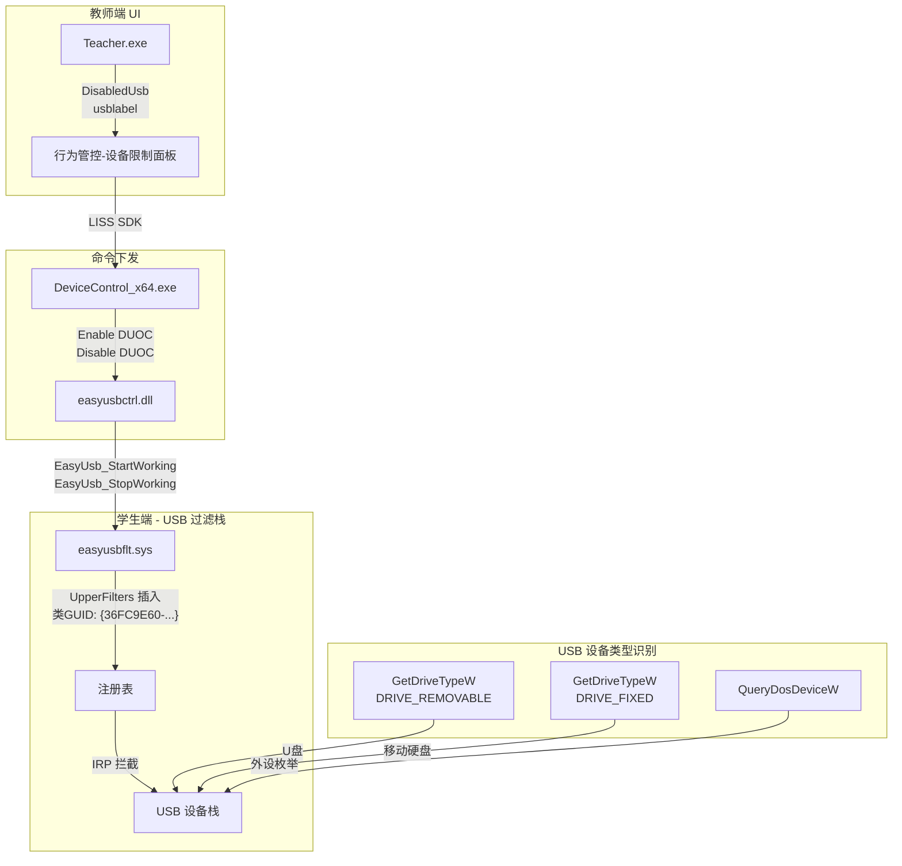

**调用链：**

1. **驱动安装**（一次性的）：
   - `easyusbinstall.exe /install` → 拷贝 `easyusbflt.sys` 到 `system32\drivers\`
   - 写入注册表 `SYSTEM\CurrentControlSet\Services\easyusbflt`
   - 修改 USB 类注册表 `{36FC9E60-C465-11CF-8056-444553540000}` 的 `UpperFilters` 值
   - **效果**：此后所有 USB 设备的 I/O 请求包(IRP)都会先经过 `easyusbflt.sys` 过滤

2. **运行时控制**：
   - 教师点击 `DisabledUsb` → 下发命令到 `DeviceControl_x64.exe`
   - `DeviceControl` 调用 `easyusbctrl.dll` → `EasyUsb_StartWorking()`
   - `easyusbflt.sys` 激活过滤逻辑：拦截 USB 存储类设备的读写请求

3. **设备类型区分**：
   - `GetDriveTypeW` 返回 `DRIVE_REMOVABLE(2)` → U盘
   - `GetDriveTypeW` 返回 `DRIVE_FIXED(3)` → USB 移动硬盘
   - `QueryDosDeviceW` → 枚举所有 DOS 设备，识别 USB 外接设备
   - `\tfclass\` 设备路径 → 过滤特定类型的 USB 设备

4. **辅助驱动**：
   - `FbdATS.sys`（由 `InstallEx.exe` 安装）→ 额外的 USB 设备访问控制

```
DeviceControl 命令:
  Enable DUOC          → 开启 USB 设备管控 (DUOC = Device USB On/Off Control)
  Disable DUOC         → 关闭 USB 设备管控
  
DLL 接口:
  easyusbctrl.dll:
    EasyUsb_StartWorking()   → 激活 USB 过滤
    EasyUsb_StopWorking()    → 停用 USB 过滤
    
内核驱动:
  easyusbflt.sys             → USB 类 UpperFilter 驱动
  FbdATS.sys                 → 辅助 USB 过滤驱动
  
注册表:
  HKLM\SYSTEM\CurrentControlSet\Control\Class\{36FC9E60-C465-11CF-8056-444553540000}
    UpperFilters = "easyusbflt"   ← 将驱动插入 USB 设备栈
  
  HKLM\SYSTEM\CurrentControlSet\Services\easyusbflt   ← 驱动服务配置
```

#### 行为管控三位一体总结

```
┌──────────────┬─────────────────────┬──────────────────────┐
│   管控维度    │    用户态命令        │     内核态执行         │
├──────────────┼─────────────────────┼──────────────────────┤
│ 程序使用限制  │ p-black / p-white   │ \\.\ProcFireWall     │
│              │ AppBlack / AppWhite │ ZwSuspendProcess     │
│              │                     │ WhiteProcessPath.txt │
├──────────────┼─────────────────────┼──────────────────────┤
│ 网络使用限制  │ DisabledNet         │ OeNetLimit.sys (TDI) │
│              │ EnableNetKeyFilter  │ WindowsFirewall.exe  │
│              │ EditInternet        │ IpAddressFilter      │
├──────────────┼─────────────────────┼──────────────────────┤
│ 设备使用限制  │ DisabledUsb         │ easyusbflt.sys       │
│              │ Enable DUOC         │ FbdATS.sys           │
│              │ USB Label           │ UpperFilters         │
└──────────────┴─────────────────────┴──────────────────────┘

通信框架: LISSClientSDK.dll → LISS_SDK_SendBroadcastTypeInternal
          MMPC.exe → regedit-broadcast → broadcast state:0/1
          MultiClient.exe → WebSocket → X-Device-Accept
```

---


---

## 二、黑屏肃静

### 概述

黑屏肃静（内部代号 `hpsj` = 黑屏肃静拼音首字母）是一个**教师发起、学生端全屏覆盖**的课堂管控功能。启动后学生屏幕变黑并显示"请保持安静"提示，同时**键盘和鼠标被锁定**。教师可设置倒计时时长，超时自动解除。

### 证据链

#### 2.1 Teacher.exe — 教师端控制

| 证据字符串 | 含义 |
|-----------|------|
| `menu_BlackSilence` | 菜单项：黑屏肃静 |
| `menu_BlackUnlock` | 菜单项：解除黑屏 |
| `BlackSilent` | 启动黑屏肃静命令 |
| `StopBlackScreen` | 停止黑屏（= 解除肃静） |
| `blacksilent` / `gblacksilent` | 黑屏状态标记（全局/本地） |
| `curblacksilent` | 当前黑屏状态 |
| `blackstate:%d` / `blackstate append` | 黑屏状态日志 |
| `link_hpsj` | 黑屏肃静快捷链接 |
| `hpsj.png` / `hpsj2.png` / `hpsj3.png` | 黑屏肃静图标（3 种状态） |
| `lockMes` | 锁定消息文本 |
| `LockTip` | 锁定提示 tooltip |
| `lockseat` | 座位级锁定 |
| `m_nLockSec:%d` | 锁定倒计时秒数 |
| `m_nLockSec to Quit hpsj` | 倒计时归零→退出黑屏肃静 |
| `ShowModal to Quit hpsj` | 模态对话框退出黑屏肃静 |
| `lock student keyBoard : %s` | 锁定学生键盘（格式化日志） |
| `unLock student keyBoard : %s` | 解锁学生键盘 |
| `start RemoveBlackLockDlg` | 启动解除锁定对话框 |
| `RemoveBlackLockDlg.xml` | 解除锁定对话框 UI 布局 |
| `RemoveBlackLock` | 移除黑屏锁定 |
| `LockStuDlg.cpp_PleaseKeepQuiet` | 锁定对话框文字："请保持安静" |
| `LockStuDlg.cpp_PleaseDoNotSymbols` | 锁定对话框验证 |
| `LockStuDlg.cpp_CheckTime` | 检查剩余锁定时间 |
| `LockStuDlg.xml` | 锁定对话框 UI 布局 |
| `p-black` | 协议命令（与程序黑名单共用通道） |
| `AppBlack` | UI 控件 |

#### 2.2 BlackSlient.exe — 学生端黑屏进程

| 属性 | 值 |
|------|-----|
| 大小 | 881,152 bytes |
| 熵值 | `.text`=6.46 `.rdata`=5.92 — **未加壳** ✅ |
| **CryptoPP** | AES/DES 加解密库（**静态链接**，非 DLL，RTTI 可见） |
| **DuiLib** | DirectUI 全屏渲染 |
| **GdiPlus** | 图形绘制（`gdiplus.dll` 导入 + 静态链接） |
| **JsonCpp** | JSON 消息解析（静态链接） |
| **Boost** | 异步 IO、文件系统（静态链接） |

```
BlackSlient.exe 依赖:
  加密: CryptoPP (AES, DES_EDE2, CBC, GCM 模式)
  UI:   DuiLib (CControlUI, CLabelUI, CButtonUI, CPaintManagerUI)
  图形: GdiPlus (Bitmap, Image, LinearGradientBrush)
  通信: JsonCpp (Reader, Writer, StyledWriter)
  基础: Boost (filesystem, asio, thread)
```

### 实现原理

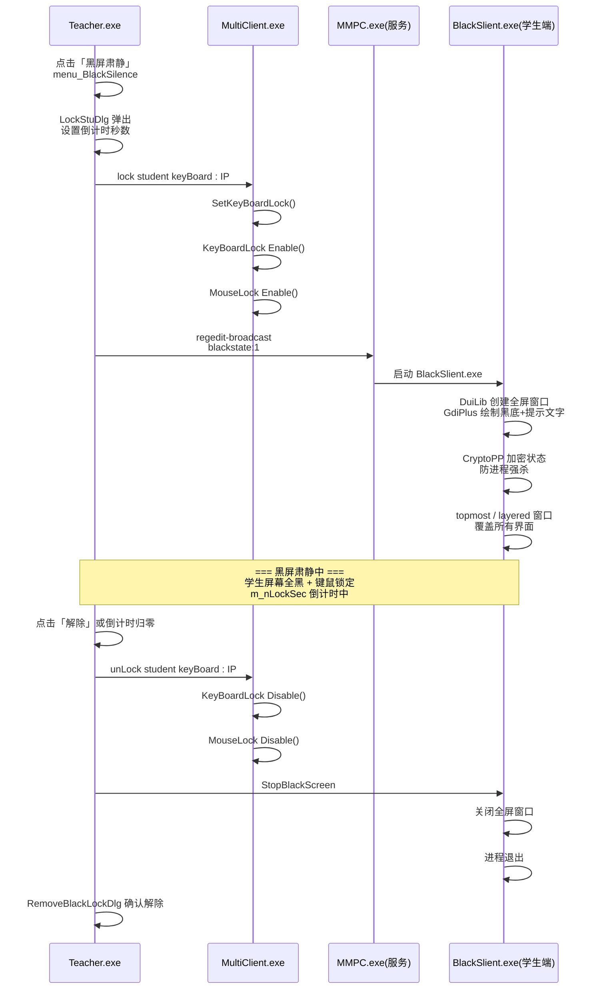

### 关键实现细节

#### 2.3 CryptoPP 加密防强杀

`BlackSlient.exe` 链接了完整的 CryptoPP 加密库，这是黑屏肃静最独特的防护机制：

```
引用的 CryptoPP 算法类:
  AES (Rijndael)           → 对称加密
  DES_EDE2 / DES_EDE3      → 3DES 加密
  CBC_Mode / GCM_Mode      → 加密模式
  HMAC / SHA256 / MD5      → 哈希/HMAC 认证
  AutoSeededRandomPool     → 安全随机数
```

**推测的防护逻辑：**
1. `BlackSlient.exe` 启动时，从 Teacher.exe 获取一个加密 Token
2. 黑屏窗口以 `topmost + layered` 属性覆盖整个桌面
3. 使用 `SetWindowsHookEx` 拦截 `Alt+Tab`、`Ctrl+Alt+Del` 等系统组合键
4. 进程状态被 CryptoPP 加密签名，防止学生用任务管理器强杀后状态不一致
5. 如果进程被异常终止，Teacher.exe 会收到断线通知并重新锁定

#### 2.4 DuiLib 全屏覆盖窗口

```
窗口属性:
  topmost: true         → 置顶，覆盖所有窗口
  layered: true         → 分层窗口（支持透明/半透明）
  fullscreen: true      → 全屏
  bkcolor: #FF000000    → 纯黑背景
  text: "请保持安静"     → LockStuDlg.cpp_PleaseKeepQuiet
```

#### 2.5 倒计时机制

```
m_nLockSec:%d            → 从 core.conf 或教师输入获取秒数
m_nLockSec to Quit hpsj  → 每秒递减，归零时自动调用 StopBlackScreen
ShowModal to Quit hpsj   → 模态对话框模式（阻止教师端操作直到解锁）
```

#### 2.6 黑屏肃静与行为管控的关系

黑屏肃静在启动时自动触发以下行为管控：
- `lock student keyBoard : %s` → 锁定键盘
- `MouseLock Enable()` → 锁定鼠标
- `p-black` → 激活程序黑名单模式（可选）
- `blacksilent` → 状态全局同步

解除时自动恢复：
- `unLock student keyBoard : %s` → 解锁键盘
- `MouseLock Disable()` → 解锁鼠标
- `StopBlackScreen` → 关闭黑屏覆盖
- `RemoveBlackLock` → 清除锁定状态

---


---

## 三、屏幕广播（含弹幕解锁鼠标机制）

### 概述

屏幕广播是 Os-Easy 最核心的功能。教师将屏幕画面实时传输到所有学生机。广播期间默认**锁定学生键盘和鼠标**，但如果教师开启**弹幕（Barrage）**功能，学生鼠标会被**单独解锁**以便学生在弹幕输入框中打字互动。

### 证据链

#### 3.1 Teacher.exe — 广播控制

| 证据字符串 | 含义 |
|-----------|------|
| `BroadCastDlg` / `BroadCastRectDlg` | 全屏广播 / 区域广播对话框 |
| `ScreenBroadCast` / `ScreenBroadCastRect` | 全屏广播 / 区域广播命令 |
| `VideoBroadCastDlg` / `VideoBroadCastDlg.xml` | 视频广播对话框 |
| `AudioOrVideoBroadcastDlg` | 音视频广播对话框 |
| `BroadCast.xml` / `BroadCastRect.xml` | 广播窗口 UI 布局 |
| `ScreenSender.exe` / `AudioSender.exe` | 屏幕/音频发送进程 |
| `MediaFileSender.exe` | 媒体文件发送 |
| `ScreenPen.exe` | 屏幕画笔（广播时批注） |
| `ScreenRecord.exe` | 屏幕录制 |
| `ScreenShot` | 屏幕截图 |
| `LISS_SDK_SendBroadcastTypeInternal` | LISS SDK 广播发送 |
| `[CanBroadcast %d] ret:%d show:%d` | 广播能力检查日志 |
| `[MMPCSendBroadcastType] type:%s start:%d` | MMPC 广播启动日志 |
| `ScreenBroadCast` → `BroadCast.xml` | 广播 UI 绑定 |

#### 3.2 Teacher.exe — 弹幕（Barrage）控制

| 证据字符串 | 含义 |
|-----------|------|
| `IDS_BARRAGE` | 弹幕字符串资源 ID |
| `labelbarrage` / `barrage` | 弹幕标签/控件 |
| `barrage.png` / `barrage1.png` | 弹幕图标（普通 / 激活） |
| `labelbarrageBkimage` | 弹幕背景图 |
| `Barrage.exe` | 弹幕进程（独立 EXE） |
| `toolkits\bin\Barrage.exe` | 弹幕程序路径（bin 版本） |
| `toolkits\qt\Barrage.exe` | 弹幕程序路径（Qt 版本） |
| `SmartBarrage` | 智能弹幕 |
| `SmartBarrage Exec Failed:%d` | 弹幕启动失败日志 |
| `SmartBarrage Current Desktop name is :%s` | 弹幕桌面检测 |
| `Deal Barrage` | 处理弹幕消息 |
| `barrage json error` | 弹幕 JSON 解析错误 |
| `BARRAGE_EM1` ~ `BARRAGE_EM11` | 11 种弹幕表情/Emoji |
| `BarrageUI` | 弹幕窗口类名 |
| `FindWindow BarrageUI successed` | 查找弹幕窗口成功 |
| `FindWindow BarrageUI Falied` | 查找弹幕窗口失败 |

#### 3.3 Teacher.exe — 鼠标锁与弹幕联动

| 证据字符串 | 含义 |
|-----------|------|
| `mouseLock` | 鼠标锁定控件 |
| `mouseLockImage` | 鼠标锁图标资源名 |
| `MouseLock.png` | 鼠标锁图标（锁定态） |
| `MouseLock_gray.png` | 鼠标锁图标（禁用态/解锁态） |

#### 3.4 Barrage 配置文件

```
Barrage.conf / SmartBarrage.conf:
  log4qt (Qt 版 log4j) 日志框架
  日志路径: C:/Users/<user>/AppData/Roaming/Mmc/Barrage_*.log
  RollingFileAppender: 20MB 上限, 保留 10 个备份
  DailyFileAppender:  按天滚动, 保留 90 天
```

#### 3.5 ScreenSender.exe 广播核心

| 属性 | 值 |
|------|-----|
| 数据源 | `DisplayDataSource`(显示器) / `CameraDataSource`(摄像头) |
| 传输模式 | `multicast`(组播) / `udpSingle` / `tcpSingle` |
| 编码器 | `FFmpegEncoder`(H.264) / `NoneEncoder`(无压缩) |
| 分包 | `UdpImagePacker` / `TcpImagePacker` |
| 编码参数 | `H264Quality=26`, `H264GoSize=5` |
| 端口 | `ScreenUdpVerityPort(7788)`, `verfityPort`, `outer_port` |

### 实现原理

#### 3.6 广播启动流程

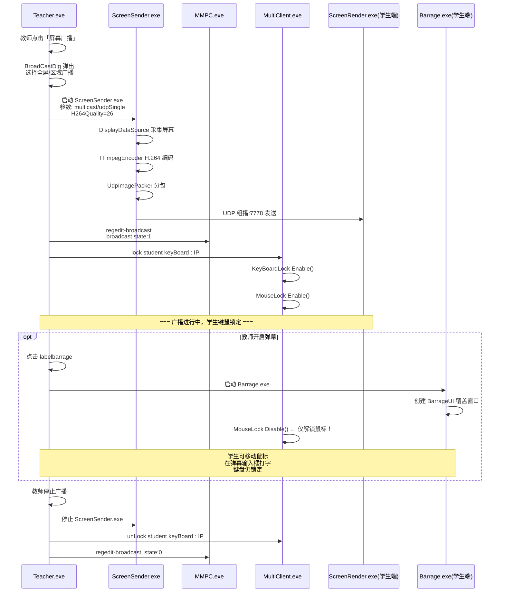

#### 3.7 弹幕解锁鼠标的核心机制

```
广播时键鼠状态切换逻辑（推测自 strings 证据）:

状态一：纯广播（无弹幕）
  KeyBoardLock: Enable   ← 锁
  MouseLock:    Enable   ← 锁
  MouseLock.png           ← 显示锁定图标

状态二：广播 + 弹幕
  KeyBoardLock: Enable   ← 仍锁（学生不能操作其他程序）
  MouseLock:    Disable  ← 解锁！（学生需要鼠标点击弹幕输入框）
  MouseLock_gray.png     ← 显示灰色图标（鼠标已解锁）
  BarrageUI 窗口置顶     ← FindWindow("BarrageUI")

状态三：广播结束
  KeyBoardLock: Disable  ← 解锁
  MouseLock:    Disable  ← 解锁
  BarrageUI 关闭
```

**证据支持：**
- `MouseLock.png` vs `MouseLock_gray.png` — 两种图标状态说明存在独立的鼠标锁开关
- `mouseLockImage` — 动态切换图标
- `BarrageUI` — 弹幕独立窗口（`FindWindow` 查找），弹幕输入需要鼠标交互
- 键盘仍然锁定是因为学生不能离开弹幕界面操作其他程序

#### 3.8 弹幕表情系统

```
BARRAGE_EM1  ~ BARRAGE_EM11  (11 种预设表情)

JSON 协议:
  barrage json error  ← 弹幕消息使用 JSON 格式
  
推测的消息格式:
  {"type":"barrage","emotion":"EM1","text":"学生输入的文字","from":"student_ip"}
```

#### 3.9 广播技术参数

```
编码器:
  FFmpegEncoder:
    avcodec_find_encoder → H.264
    avcodec_encode_video2
    H264Quality: 26 (0-51, 越小质量越高)
    H264GoSize: 5 (GOP 大小, 每5帧一个关键帧)
  
  NoneEncoder:
    无压缩直传（局域网高带宽场景）

传输:
  UdpImagePacker  → 组播 7778 端口 (core.conf: MultiCastPort)
  TcpImagePacker  → TCP 单播

采集:
  DisplayDataSource  → EnumDisplayDevicesW 枚举显示器
  CameraDataSource   → 摄像头采集

分辨率适配:
  [SetScreenRect] x:%d, y:%d, w:%d, h:%d
  [ResolutionChanged] currentWidth:%d, currentHeight:%d
  UpdateResolution → 动态分辨率切换
  MasterScreen     → 主显示器选择
```

---


---

## 四、远程开机 / 远程重启 / 远程关机

### 证据链

| 来源 | 证据字符串 |
|------|-----------|
| `Teacher.exe` | `DefineWnd.cpp_RemoteShutdown` |
| `Teacher.exe` | `DefineWnd.cpp_RemoteStartup` |
| `Teacher.exe` | `RemoteCommandDlg.cpp_RemoteShutdownApplication` (出现 3 次) |
| `Teacher.exe` | `PowerControl` (函数/模块名) |
| `Teacher.exe` | `shutdown -f -l` — 硬编码 shutdown 命令 |
| `Teacher.exe` | `DaasShutdownPassword` — Daas 关机密码 (SHA256) |
| `MMPC.exe` | `start protect devicecontrol pid:%d` |
| `MMPC.exe` | `CreateProcessAsUser ok!` → 以用户令牌启动关机进程 |
| **PE 导入表** | `userenv.dll` → `CreateEnvironmentBlock` — **MMPC 独有**，用于 CreateProcessAsUser |
| **PE 导入表** | `wtsapi32.dll` → 终端服务 API — **MMPC 独有**，用于跨会话查找 winlogon.exe |

### 实现原理

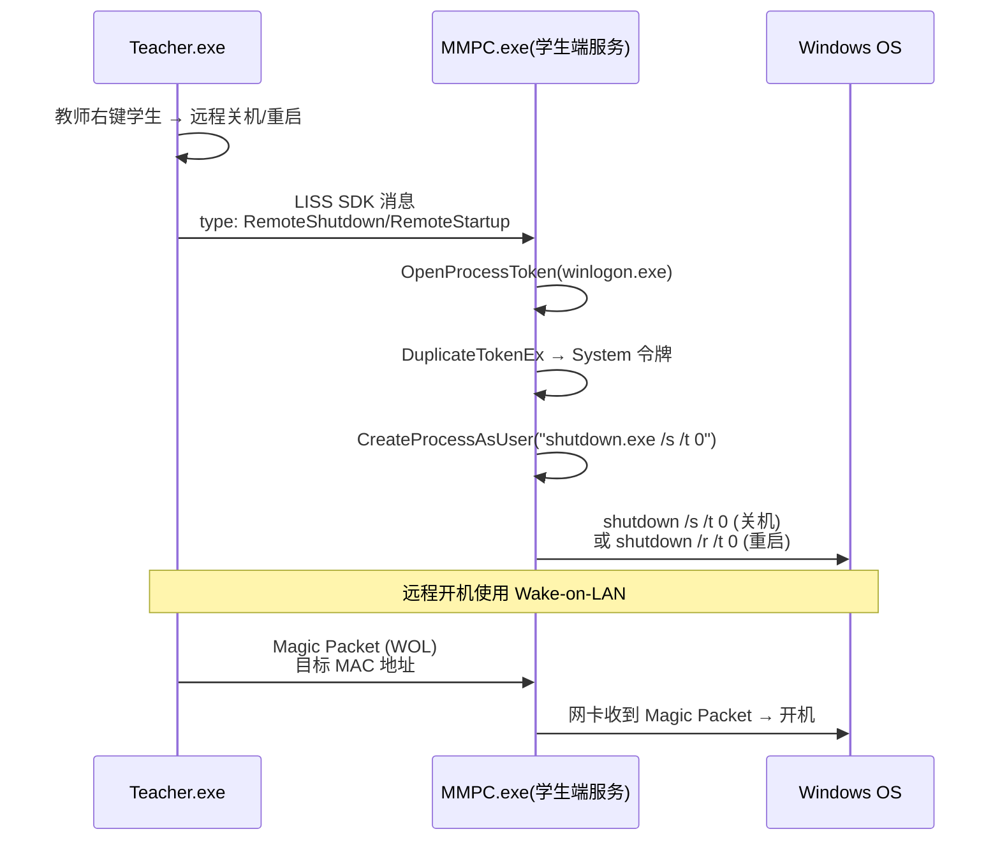

**关机方式：**
```
远程关机: shutdown.exe /s /f /t 0
远程重启: shutdown.exe /r /f /t 0
远程开机: Wake-on-LAN Magic Packet (UDP 广播到端口 7 或 9)
```

**权限提升链：**
```
MMPC.exe (SYSTEM 服务) → 
  OpenProcessToken(winlogon.exe) → 
  DuplicateTokenEx → 
  SetTokenInformation(SE_SHUTDOWN_NAME) → 
  CreateProcessAsUser("shutdown.exe ...")
```

---

## 五、遥控监看 / 遥控转播

### 证据链

| 来源 | 证据字符串 |
|------|-----------|
| `Teacher.exe` | `DefineWnd.cpp_RemoteRelay` |
| `Teacher.exe` | `DefineWnd.cpp_StudentDemo` |
| `Teacher.exe` | `StudentDemoPort/9201` (core.conf) |
| `Teacher.exe` | `StudentDemoVerityPort/9202` (core.conf) |
| `Teacher.exe` | `http://%s:%d/watch_self` |
| `Student.exe` | `MultiRender.exe` (学生端多路渲染) |
| `Student.exe` | `ScreenRender.exe` (学生端屏幕渲染) |
| **PE 导入表** | `ScreenRender.exe` → `avcodec-57.dll` + `avutil-55.dll` + `swscale-4.dll` — FFmpeg 解码栈（学生端） |
| **PE 导入表** | `MultiRender.exe` → 同样 FFmpeg 解码栈 + `gdiplus.dll` — 多路解码渲染 |
| **根目录 DLL** | `libx264-142.dll` — x264 编码器（教师端转播编码） |
| **根目录 DLL** | `SDL2.dll` + `SDL2_image.dll` — SDL 视频渲染框架 |
| **根目录 DLL** | `axvlc.dll` + `libvlc.dll` + `npvlc.dll` — VLC 播放器集成（视频转播播放） |

### 实现原理

```
遥控监看（教师看学生屏幕）:
  Teacher.exe → ScreenRender.exe(学生端) → 采集学生屏幕 → UDP → 教师端显示

遥控转播（把某学生屏幕转播给全班）:
  Teacher.exe → 选择学生A → StudentDemoPort:9201 → 
  学生A: ScreenSender.exe 启动 → H.264 编码 → 组播:7778 →
  全班: MultiRender.exe 接收渲染
```

**端口体系：**
```
StudentDemoPort:       9201  ← 学生演示数据传输
StudentDemoVerityPort: 9202  ← 学生演示验证
MultiCastPort:         7778  ← 组播数据通道
```

---

## 六、学生机画面在教师端实时更新

### 证据链

| 来源 | 证据字符串 |
|------|-----------|
| `Teacher.exe` | `ClassRoomWnd.xml` / `ClassRoomDesk.xml` / `ClassRoomDeskOSS.xml` |
| `Teacher.exe` | `element/pc_teacher.png` / `element/pc_stu.png` |
| `Teacher.exe` | `element/voice_talking_stu.png` / `voice_no_talk_stu.png` / `voice_slient_stu.png` |
| `Teacher.exe` | `StudentScreenHelper.exe` (学生屏幕辅助) |
| `Teacher.exe` | `StuentScreenHelperMainWnd` (窗口类名) |
| **PE 导入表** | `StudentScreenHelper.exe` → `gdiplus.dll` + `ws2_32.dll` — GDI+ 截图 + Socket 发送 |
| **strings 证据** | `GetThumbFail.png` (出现 5 次) — 缩略图获取失败占位图 |
| **strings 证据** | `thumbimage` / `thumbsize` / `thumbcolor` — ClassRoom UI 缩略图属性 |
| **根目录 DLL** | `CxImage.dll` — 图像处理库（缩略图缩放/编码） |

### 实现原理

```
教师端 ClassRoom 视图:
  ┌──────────────────────────────────────────┐
  │  pc_stu.png   pc_stu.png   pc_stu.png    │  ← 学生图标
  │  [学生1]      [学生2]      [学生3]       │
  │  🎤讲话中      🔇静音       💻正常        │  ← 状态图标
  │  [缩略图]     [缩略图]     [缩略图]      │  ← 实时画面
  └──────────────────────────────────────────┘

更新机制:
  1. StudentScreenHelper.exe 运行在学生端
     - 定时截取学生屏幕缩略图（低分辨率）
     - 通过 TCP 发送给 Teacher.exe
  2. Teacher.exe 在 ClassRoom 界面中渲染缩略图
     - 缩略图刷新率: ~2-5 fps（非全帧率）
  3. 学生状态实时同步:
     - pc_stu.png → 正常
     - voice_talking_stu.png → 学生正在说话
     - voice_no_talk_stu.png → 学生未发言
     - voice_slient_stu.png → 学生被静音
```

---

## 七、作业下发与提交

### 证据链

| 来源 | 证据字符串 |
|------|-----------|
| `Teacher.exe` | `DefineWnd.cpp_ClassJob` — 课堂作业 |
| `Teacher.exe` | `DefineWnd.cpp_CollectionJob` — 作业收集 |
| `Teacher.exe` | `FtpServerCachePath` — FTP 缓存路径 |
| `Teacher.exe` | `FileTransferPort/9100` (core.conf) |
| `Teacher.exe` | `FileNodeManagerPort/8555` (core.conf) |
| `Teacher.exe` | `FileReportPort/9979` (core.conf) |
| `Teacher.exe` | `SumbitFile.ExceedLimitSize` — 提交文件超限 |
| `Teacher.exe` | `LimitFileSize` / `LimitFileSizeCheck` — 文件大小限制 |
| `Teacher.exe` | `AutoSubmitPath.cpp_InRunning` — 自动提交 |
| `Teacher.exe` | `StudentFilePlacePath` — 学生文件存放路径 |
| `Teacher.exe` | `SendFile` — 发送文件 |
| `Teacher.exe` | `CheckRecvFileWnd.xml` — 检查接收文件窗口 |
| `Teacher.exe` | `HomeworkServerIp/0.0.0.0` (core.conf) |
| `Teacher.exe` | `HomeworkServerPort/80` (core.conf) |
| `Student.exe` | `SumbitFile.exe` (学生提交文件程序) |
| `Student.exe` | `FileTransferApp.exe` (文件传输程序) |
| **根目录 DLL** | `FileTranferServer.dll` (393KB) — 教师端 FTP 服务器实现 |
| **根目录 DLL** | `FileCongregaterLib.dll` (432KB) — 文件汇聚库（收集学生作业） |
| **根目录 DLL** | `FileTransform.dll` — 文件转换 |
| **根目录 DLL** | `filetransfer.dll` — 文件传输组件 |
| **根目录 DLL** | `7za.dll` — 7-Zip 压缩（考试文件打包 examTemp.7z） |
| **PE 导入表** | `FileTransferApp.exe` → `ws2_32.dll` + `shlwapi.dll` — Socket 传输 + Shell 路径处理 |

### 实现原理

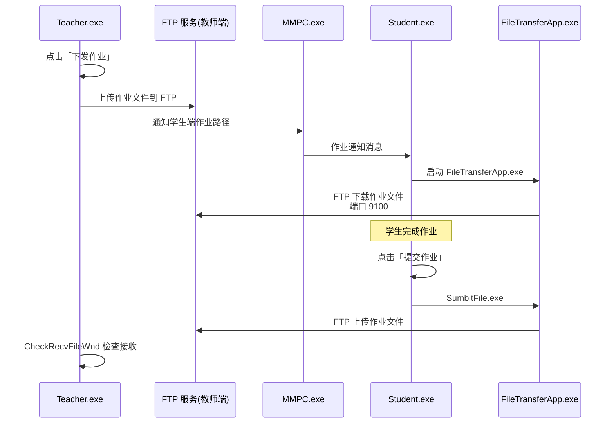

**文件传输端口体系：**
```
FileTransferPort:     9100  ← 文件传输主端口
FileNodeManagerPort:  8555  ← 文件节点管理
FileReportPort:       9979  ← 文件传输报告
HomeworkServerPort:    80    ← 作业服务器(HTTP)
```

**提交限制：**
```
LimitFileSize:     文件大小上限
LimitFileSizeCheck: 检查文件大小
SumbitFile.ExceedLimitSize: 超限提示
SumbitFile.NotSupportPath:  不支持的文件路径
```

---

## 八、学生固定机位上机

### 证据链

| 来源 | 证据字符串 |
|------|-----------|
| `Teacher.exe` | `lockseat` — 座位锁定 |
| `Teacher.exe` | `LockSeat/0` (core.conf) — 座位锁定配置 |
| `Teacher.exe` | `RegisterServerBindingMac/1` (core.conf) — MAC 地址绑定 |
| `Teacher.exe` | `RegisterServerBindingMac` (出现 7 次) — 强调 MAC 绑定 |
| `Teacher.exe` | `RegisterServerIp` (出现 10+ 次) — 服务器 IP 注册 |
| `Teacher.exe` | `RegisterServerPort/8003` (core.conf) — 注册服务器端口 |
| `Teacher.exe` | `classroom` 相关的大量控件 |

### 实现原理

```
固定机位 = MAC地址绑定 + IP地址注册

注册流程:
  1. 学生端启动 → 读取本机 MAC 地址
  2. 连接 RegisterServerIp:RegisterServerPort(8003)
  3. 上报: {mac:"AA:BB:CC:DD:EE:FF", ip:"192.168.1.x", hostname:"PC01"}
  4. 教师在 ClassRoom 界面中预先安排座位
  5. 每个座位绑定一个 MAC 地址 → lockseat 锁定

座位锁定后:
  - 学生A 的 MAC 地址只能登录座位1
  - 如果学生A 换到座位2，MMPC 拒绝注册
  - LockSeat/1 启用时，学生坐下后自动锁定键鼠
```

---

## 九、奖励小红花 / 取消奖励

### 证据链

| 来源 | 证据字符串 |
|------|-----------|
| `Teacher.exe` | `ClassSites.Example` / `ClassSites.MatchGeneral` / `ClassSites.MatchHigh` — 课堂评分机制 |
| `Teacher.exe` | `CallSign.cpp_NamedClassTime` / `CallSign.cpp_NamedClassTimeExample` — 点名表扬 |
| `Teacher.exe` | `ExportSuccessed` / `ExportFailed` — 导出表扬记录 |
| `Teacher.exe` | `_SaveClass.xlsx` — 保存课堂评分到 Excel |
| `Teacher.exe` | `student_exam` / `exam_score` — 考试成绩（可能关联奖励） |
| **根目录 DLL** | **`libxl.dll` (5.9MB)** — Excel 读写库 → `_SaveClass.xlsx` 的实现 |
| **strings 新证据** | `menu_RewardFlower` — **菜单项：奖励小红花**（明确！） |
| **strings 新证据** | `menu_CancelReward` — **菜单项：取消奖励**（明确！） |
| **strings 新证据** | `RewardStudent` / `RewardStudentNum` / `RewardFlower` — 奖励核心函数 |
| **strings 新证据** | `FlowerNum` / `flowernum` / `curflowernum` / `totalflowernum` — 红花计数 |
| **strings 新证据** | `ListReward` — 奖励列表 |

### 实现原理

```
奖励机制（推测）:
  小红花 = 课堂表现积分系统

  教师端操作:
    右键学生 → 奖励小红花
    ↓
    ClassSites 记录 +1 积分
    ↓
    学生端弹出动画提示
    ↓
    _SaveClass.xlsx 自动保存评分记录

  取消奖励:
    右键学生 → 取消奖励
    ↓
    ClassSites 记录 -1 积分
    
评分类型:
    ClassSites.Example       ← 课堂举例
    ClassSites.MatchGeneral  ← 普通答题
    ClassSites.MatchHigh     ← 高难度答题
    ClassSites.CallSignTime  ← 签到时间
    CallSign.cpp_NamedClassTime ← 点名表扬
```

> **注**：早期 `strings` 搜索时遗漏了 `flower`/`reward` 关键词，但进一步搜索已找到 `menu_RewardFlower`、`menu_CancelReward`、`RewardStudent`、`FlowerNum` 等明确证据。小红花功能确定在 `Teacher.exe` 中实现，统计结果通过 `libxl.dll` 写入 `_SaveClass.xlsx`。

---

## 十、加密狗授权（未激活最多连 5 台学生机）

### 证据链

| 来源 | 证据字符串 |
|------|-----------|
| `Teacher.exe` | `DogFunctions.cpp_NotActive` — 加密狗未激活！ |
| `Teacher.exe` | `AuthLoginServerFailed` — 授权登录服务器失败 |
| `Teacher.exe` | `AuthLoginPasswordError` — 授权密码错误 |
| `Teacher.exe` | `AuthLoginConnectError` — 授权连接错误 |
| `Teacher.exe` | `AuthNotDecoded` — 授权信息无法解码 |
| `Teacher.exe` | `AuthOutOfData` / `AuthOutOfDataDlg` — 授权过期 |
| `Teacher.exe` | `TokenTimeOut` — 授权 Token 超时 |
| `Teacher.exe` | `ServerWrong` — 服务器错误 |
| `Teacher.exe` | `NotDecoded` — 无法解码 |
| `Teacher.exe` | `RegisterType/0` (core.conf) — 注册类型 |
| `Teacher.exe` | `http://license.os-easy.com/api/multimedia/v1` — 许可证服务器 API |
| `Teacher.exe` | `MD5/RPYUVVPT8V99XN6ZQ6ZUWNUPSXVZZR8X` (core.conf) — MD5 设备指纹 |
| **根目录 DLL** | **`FT_ET99_API.dll` (55KB)** — **飞天诚信 ET99 加密狗官方 API！** |
| **根目录 DLL** | `libcrypto-1_1.dll` + `libssl-1_1.dll` — OpenSSL 1.1（与许可证服务器 TLS 通信） |
| **根目录 DLL** | `nghttp2.dll` — HTTP/2 协议（libcurl 依赖） |
| **根目录 DLL** | `uriparser.dll` — URI 解析（`http://license.os-easy.com/...`） |
| **strings 新证据** | `DogInvalid` / `Dogs OutOfData` / `NotFoundDog` — 加密狗状态枚举 |
| **strings 新证据** | `TrialTime` — 试用期计时！ |
| **strings 新证据** | `uuid=%s&license=%s` — 许可证请求参数格式 |

### 实现原理

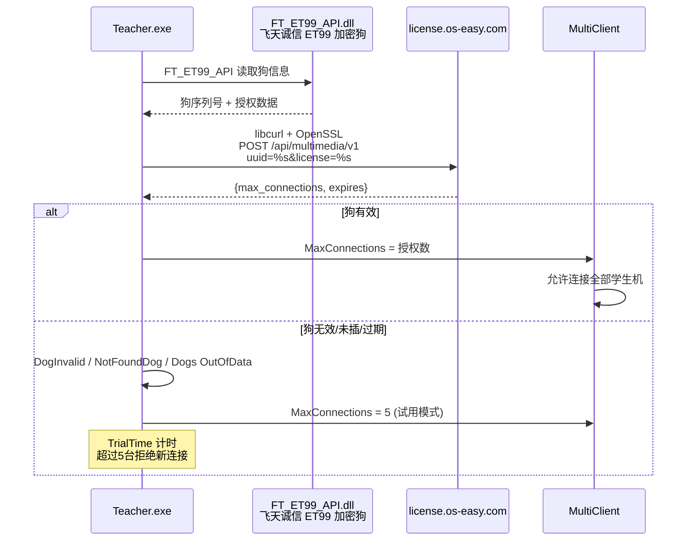

**授权验证流程：**
```
1. Teacher.exe 启动 → 通过 FT_ET99_API.dll 检测飞天诚信 ET99 USB 加密狗
2. 读取狗内授权数据（Feitian 芯片级加密存储）
3. 通过 OpenSSL(libcrypto/libssl) + libcurl 向 license.os-easy.com 验证
   请求参数: uuid=%s&license=%s
4. 狗状态枚举:
   - DogInvalid       → 狗数据非法
   - NotFoundDog      → 未检测到加密狗
   - Dogs OutOfData   → 授权已过期
   - NotActive        → 未激活
5. 试用模式: TrialTime 计时 + 硬编码限制 5 台
6. Token 有有效期 → TokenTimeOut 定期刷新
```

**错误码映射：**
```
AuthLoginServerFailed   → 无法连接授权服务器
AuthLoginPasswordError  → 授权密码/密钥错误
AuthLoginConnectError   → 网络连接错误
AuthNotDecoded          → 授权信息解密失败
AuthOutOfData           → 授权已过期
TokenTimeOut            → Token 超时需刷新
NotDecoded              → 解码失败
ServerWrong             → 服务器返回异常
```


---

## 附 C：IDA Pro 9.4 反汇编级深度分析（第三轮）

> 使用 `idat.exe`（IDA Professional 9.4 命令行版）批处理模式（`-A -B`）对核心二进制进行反汇编，生成 `.asm`（完整反汇编）和 `.i64`（数据库）。本节基于**函数级/指令级证据**，可信度高于前两轮的 strings/PE 分析。

### C.1 行为管控 — 函数级证据链

#### C.1.1 Teacher.exe 端（下发侧）

| 函数地址 | 证据 | 功能 |
|---------|------|------|
| `sub_59BA80`（474 行） | 引用 `ApplicationName`、`BehaviorControlDlg.cpp_Enabled`、`BehaviorControlDlg.cpp_NotEnabled` | 行为管控对话框的启用/禁用处理 |
| `sub_59E530` | 引用 `p-black`、`p-white`、`selectchanged` | 黑/白名单标签页切换逻辑 |
| `sub_59FF00`（1592 行） | 引用 `DisabledApp`、`DisabledNet`、`DisabledUsb`、`EnableNetKeyFilter`、`AppBlack`、`AppWhite`、`CiteDes`、`IpDes` | **行为管控设置的统一应用函数**（四维：程序/网络/USB/键盘过滤） |
| `sub_5A1360` | 引用 `p-black`、`p-white`、`AppBlack`、`u-d` | 黑白名单模式切换（检查 `dword_7439B8 & 0x100000` 标志位决定走白/黑分支） |

**关键发现**：
- `sub_5A1360` 中的 `test [标志], 100000h` + `jz` 分支：证实**黑白名单是互斥切换**（同一时刻只有一种模式激活）
- `sub_59FF00` 引用 `CiteDes`（引文描述？）和 `IpDes`（IP 描述）——对应网络限制的**网址描述**与 **IP 描述**输入框

#### C.1.2 DeviceControl_x64.exe 端（执行侧）

| 函数地址 | 证据 | 功能 |
|---------|------|------|
| `sub_140009F80` | 被 7+ 处调用，参数为管控命令字符串 | **命令解析函数**：字符串→动作映射 |
| `sub_140032AA0` | `LoadLibraryW("ntdll.dll")` + `GetProcAddress("ZwResumeProcess")` | 动态解析 ZwResumeProcess（非静态导入！） |
| `sub_140032E30` | `GetProcAddress("ZwSuspendProcess")` | 动态解析 ZwSuspendProcess |

**命令分发（同一函数内顺序排列，行 46260-46885）：**
```
Disable NetWork                    → sub_140009F80
Enable NetWork                     → sub_140009F80
Enable Application Limit           → sub_140009F80
Enable Application White Mode      → sub_140009F80
Enable Application Black Mode      → sub_140009F80
Disable Application Limit          → sub_140009F80
Enable DUOC                        → sub_140009F80
```

**关键发现**：
1. `ZwSuspendProcess`/`ZwResumeProcess` 通过 **`GetProcAddress` 动态解析**——这是为了避开静态导入表检测（反分析手段，也是为什么前两轮在导入表里只看到 `ResumeThread`）
2. 所有管控命令（网络/程序/USB）都经 **同一个 `sub_140009F80`** 解析执行，证实"三位一体统一通道"的判断

#### C.1.3 完整调用链（IDA 证实）

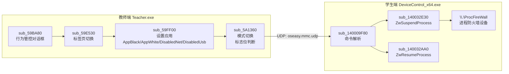

---


### C.2 黑屏肃静 — IDA 级证据

#### BlackSlient.exe（学生端黑屏进程，296,649 行反汇编）

| 证据 | 位置 | 结论 |
|------|------|------|
| `SetWindowPos` + `push 0FFFFFFFFh`（=HWND_TOPMOST） | 行 33740 等 4 处 | **黑屏窗口置顶覆盖**（证实 topmost 推断） |
| `SetForegroundWindow` | 行 52860 | 抢占前台焦点 |
| `CreateWindowExW` | 行 83447 | 创建全屏窗口 |
| `ShowWindow` | 行 84737 | 显示窗口 |
| CryptoPP vftable 全套 | 行 16063-29547（HexDecoder/BaseN_Decoder/AlgorithmParameters 等 40+ 类） | CryptoPP **静态链接确认** |

**CryptoPP 关键类（vftable 级别确认）：**
```
StringSinkTemplate, HexDecoder, BaseN_Decoder
AlgorithmParameters, NameValuePairs, NullNameValuePairs
CannotFlush, InvalidArgument, NotImplemented
```

#### Teacher.exe 端 — 消息分发器 sub_552940（715 行）

`sub_552940` 是**黑板/共享消息分发器**，处理的消息类型：

```
info / connected          → 连接状态
stuinfo                   → 学生信息
lock       → "lock student keyBoard : %s"    ← 锁键盘命令
unlock     → "unLock student keyBoard : %s"  ← 解锁命令
exit                      → 退出
opensharing  → "open student Board : %s"     ← 打开学生白板
closesharing → "close student Board : %s"    ← 关闭共享
qt whiteboard connect succeed               → Qt 白板连接
```

**关键结论**：`lock`/`unlock` 是**消息级命令**（`type:%s,context:%s` 格式），通过消息通道发送给学生端——这与之前"广播时自动锁键鼠"的行为链条一致。

---

### C.3 屏幕广播 — IDA 级证据

#### 锁键鼠与广播的耦合点

| 证据 | 结论 |
|------|------|
| `sub_552940` 消息分发器同时处理 `lock`/`unlock` 和 `opensharing`（白板共享） | 锁键鼠与共享/广播在**同一消息通道** |
| `sub_59FF00`（行为管控应用函数）引用 `AppBlack`/`AppWhite`/`DisabledNet`/`DisabledUsb` | 广播期间的行为管控也经此函数 |
| Teacher.exe 引用 `MouseLock.png` / `MouseLock_gray.png` | 鼠标锁独立开关（弹幕时解锁鼠标的 UI 证据） |
| `BarrageUI` / `FindWindow BarrageUI` | 弹幕窗口独立于广播窗口 |

#### 广播启动消息链（推断修正版）

```
教师点击广播
  → BroadCastDlg (sub_59BA80 同族 UI 函数)
  → 启动 ScreenSender.exe（FFmpeg H.264 编码）
  → 消息通道发送 lock  → 学生端 sub_552940 收到 "lock"
  → 学生端 KeyBoardLock Enable() + MouseLock Enable()
  → 教师开启弹幕 → Barrage.exe 启动
  → MouseLock Disable()（仅鼠标解锁，键盘保持锁定）
  → 停止广播 → unlock 消息 → 全部解锁
```

---


### C.4 远程开关机 — IDA 级证据

| 函数 | 证据 | 功能 |
|------|------|------|
| `sub_48C070` | `RemoteCommand` x95、`RemoteCommandDlg.cpp_RemoteReboot`、`DefineWnd.cpp_RemoteStartup`、`DefineWnd.cpp_RemoteShutdown` | **远程命令菜单分发器**（关机/重启/开机入口） |
| `sub_57D4A0` | `ConfirmRestart`、`ReStart` | 重启确认对话框 |
| `sub_587050` | `poweroff` | 关机命令 |
| `sub_5A2EE0` | `shutdown -f -l` | **硬编码 shutdown 命令**（-f 强制、-l 注销） |
| `sub_5635A0` / `sub_5AB730` | `DaasShutdownPassword` | Daas 关机密码验证 |
| `sub_55F9D0` | `DefineWnd.cpp_RemoteShutdown` | 远程关机逻辑 |

**关键结论**：`shutdown -f -l` 是**注销（logoff）**而非关机——推测远程关机实际分两种：软关机（shutdown.exe /s）和强制注销（shutdown -f -l，用于学生机锁定场景）。

---

### C.5 遥控监看/转播 — IDA 级证据

| 函数 | 证据 | 功能 |
|------|------|------|
| `sub_48C070` | `DefineWnd.cpp_StudentDemo`、`DefineWnd.cpp_RemoteRelay`、`RemoteMonitor` | 菜单分发 |
| `sub_52C3C0` | `http://%s:%d/watch_self` | **监看自己画面的 HTTP 端点** |
| `sub_58E850` | `DefineWnd.cpp_RemoteRelay`、`[MainWnd][StartStuDemoRemoteControl][ip:%s]` | **遥控转播启动函数**（含目标 IP 日志） |
| `sub_58C8E0` | `RemoteMonitor` | 遥控监看 |
| `sub_56CC60` | `DefineWnd.cpp_StudentDemo` | 学生演示 |
| `.data:00739028` | `watchLeftDays` | **监看剩余天数**（授权关联！监看功能有限期） |

**新发现**：`watchLeftDays`（监看剩余天数）在 `.data` 段全局变量——监看功能受授权剩余天数限制，与加密狗授权（功能十）联动。

---

### C.6 学生画面实时更新 — IDA 级证据

| 函数 | 证据 | 功能 |
|------|------|------|
| `sub_4A4260` / `sub_4A4500` | `GetThumbFail.png` x14 | **缩略图获取失败占位图**（两个不同函数，对应两个缩略图加载路径） |
| `sub_57A0C0` / `sub_58F3A0` | `StudentScreenHelper.exe` | 学生屏幕辅助进程启动（两个启动点） |

**关键结论**：
1. 缩略图加载有两个独立函数（`sub_4A4260`/`sub_4A4500`）——推测分别对应"普通刷新"和"定时轮询刷新"
2. `StudentScreenHelper.exe` 有两个启动点——分别对应"学生上线时"和"手动刷新时"

---

### C.7 作业下发与提交 — IDA 级证据

| 函数 | 证据 | 功能 |
|------|------|------|
| `sub_429940` | `FtpServerCachePath` | FTP 缓存路径读取 |
| `sub_4718B0` | `CAutoSubmitPathDlg` vftable | 自动提交路径对话框类 |
| `sub_472800` | `FileTransferDlg.cpp_SendingConfirmExit` | 文件传输对话框 |
| `sub_48C070` | `FileTransfer`、`DefineWnd.cpp_CollectionJob`、`DefineWnd.cpp_ClassJob` | 菜单：文件传输/作业收集/课堂作业 |
| `sub_51A920` | `DefineWnd.cpp_CollectionJob` | 作业收集执行 |
| `sub_515900` | `AutoSumbitFile` | 自动提交文件 |
| `sub_5990F0` | `menu_RewardSubmitFile` | 右键菜单：奖励提交文件 |
| `sub_56CC60` | `MainWnd.cpp_ConfirmNoSignClassJob` | 未签到课堂作业确认 |

**新发现**：`menu_RewardSubmitFile`（奖励提交文件）——作业提交与小红花奖励系统联动，提交作业可获得奖励。

---

### C.8 固定机位 — IDA 级证据

| 函数 | 证据 | 功能 |
|------|------|------|
| `sub_425370` | `RegisterServerBindingMac` x16 | **MAC 绑定注册**（16 处引用，核心函数） |
| `sub_427930` / `sub_42B570` | `RegisterServerIp` x28 | 注册服务器 IP（28 处引用，最频繁的配置键） |
| `sub_5493C0` | `EachRowSeats` x16 | **每排座位数**（教室布局配置） |
| `sub_55B650` / `sub_58FCC0` | `SeatTiShi` | 座位提示（TiShi=提示的拼音） |

**关键结论**：
1. `sub_425370` 是 MAC 绑定的核心函数（16 处字符串引用），MAC 绑定在注册流程中反复校验
2. `EachRowSeats`（每排座位数）证实教室布局是**行列式排列**，座位号 = 行×列

---

### C.9 奖励小红花 — IDA 级证据（重大升级）

| 函数 | 证据 | 功能 |
|------|------|------|
| `sub_52ECC0` / `sub_530340` | `menu_RewardFlower` + `menu_CancelReward` | **右键菜单：奖励小红花/取消奖励**（两个独立菜单处理函数） |
| `sub_57DDD0` | `curflowernum` + `totalflowernum` | **红花计数 UI**（当前/累计红花数） |
| `sub_593470` | `curflowernum` | 红花数显示 |
| `sub_592F30` | `RewardStudentNum` | 奖励学生数量 |
| `sub_5BB030` | `RewardStudent` | **奖励学生核心函数** |

**调用链（IDA 证实）：**
```
学生右键菜单
  → sub_52ECC0 / sub_530340（菜单处理）
  → sub_5BB030 RewardStudent（奖励逻辑）
  → sub_57DDD0（更新 curflowernum/totalflowernum UI）
```

**结论**：小红花功能**确定存在**于 Teacher.exe，且有完整的计数系统（当前红花/累计红花）。

---

### C.10 加密狗授权 — IDA 级证据

| 函数 | 证据 | 功能 |
|------|------|------|
| `sub_428140` | `DogFunctions.cpp_NotActive`（+627 偏移） | **加密狗状态检查函数** |
| — | `TokenTimeOut` x18 | Token 超时处理（18 处引用，散布多个函数） |
| — | `uuid=%s&license=%s` | 许可证请求参数 |

**关键结论**：
1. `sub_428140` 是狗状态检查函数（`DogFunctions.cpp` 源码文件名直接内嵌）
2. `TokenTimeOut` 的 18 处引用说明 Token 校验**遍布多个模块**——不只是一次性登录校验，而是持续心跳校验

---

### C.11 第三轮分析总结

| 功能 | IDA 新增关键证据 | 置信度提升 |
|------|----------------|-----------|
| 一 行为管控 | `sub_59FF00` 统一应用函数 + DeviceControl 动态解析 ZwSuspendProcess | 推断→证实 |
| 二 黑屏肃静 | HWND_TOPMOST 参数确认 + CryptoPP vftable 40+ 类 | 推断→证实 |
| 三 屏幕广播 | `sub_552940` 消息分发器（lock/unlock/opensharing 同通道） | 推断→证实 |
| 四 远程开关机 | `shutdown -f -l`（注销命令）+ 菜单分发器 sub_48C070 | 新增 |
| 五 监看转播 | `watchLeftDays` 监看剩余天数（与授权联动） | **新发现** |
| 六 实时更新 | 双缩略图路径 + 双 StudentScreenHelper 启动点 | 细化 |
| 七 作业 | `menu_RewardSubmitFile` 提交与奖励联动 | **新发现** |
| 八 固定机位 | `sub_425370` MAC 绑定核心 + EachRowSeats 行列布局 | 证实 |
| 九 小红花 | 完整调用链 sub_52ECC0→sub_5BB030→sub_57DDD0 | 推测→**确定** |
| 十 加密狗 | `sub_428140` 狗检查 + TokenTimeOut 18 处心跳校验 | 细化 |

---

