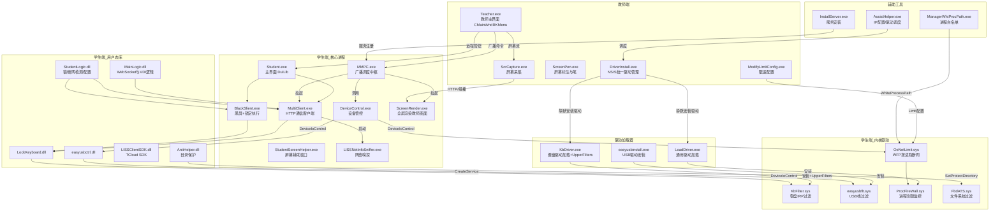
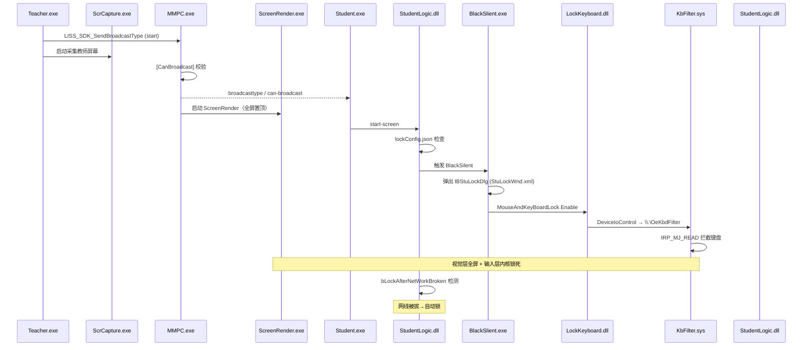
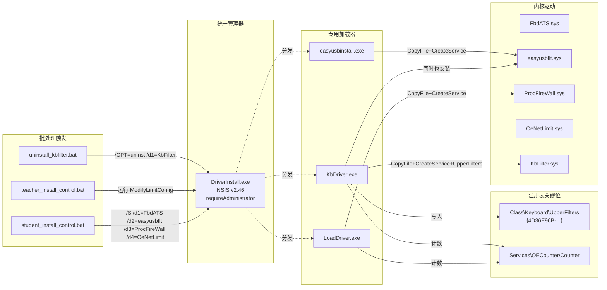
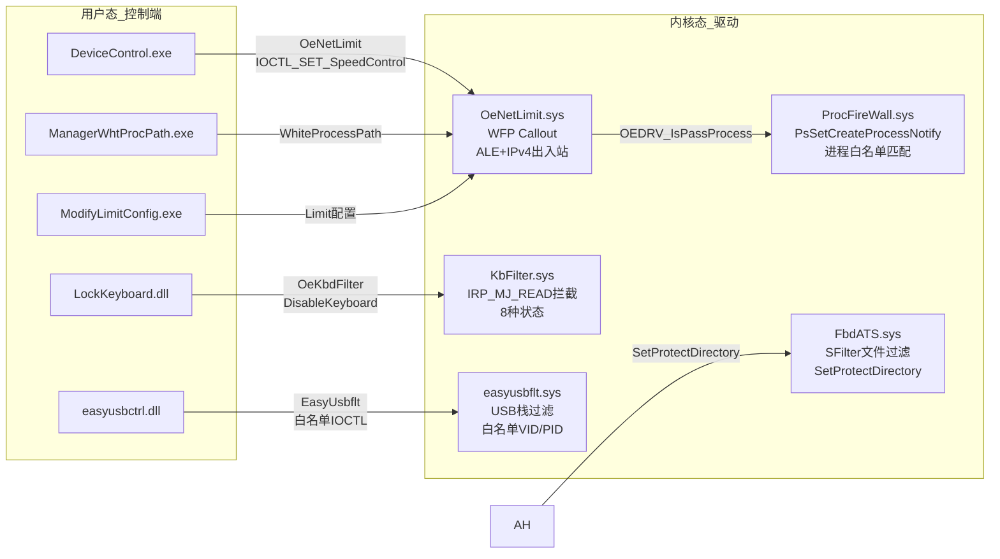

# Os-Easy（噢易）多媒体电子教室（学生端套件）静态分析报告

> 分析对象：**Os-Easy（噢易）** 多媒体网络教室/电子教室 **学生端**程序套件
> 分析方法：Sysinternals **Strings** 静态字符串提取与分析
> 分析日期：2026-08-10
> 样本路径：`C:\Users\WangDe\Desktop\Os-Easy\os-easy multicast teaching system\`
> 品牌归属：**武汉噢易科技（Os-Easy）出品，基于 MorningCloud TCloud 平台**（详见 §1.1）

---

## 目录

1. [样本总览](#一样本总览)
2. [Student.exe —— 主学生端](#二studentexe--主学生端)
3. [Teacher.exe —— 教师端](#三teacherexe--教师端)
4. [MMPC.exe —— 多媒体广播总控](#四mmpcexe--多媒体广播总控)
5. [MultiClient.exe —— 通信客户端](#五multiclientexe--通信客户端)
6. [DeviceControl_x64.exe —— 设备管控](#六devicecontrol_x64exe--设备管控)
7. [深挖：断网 / 断USB / 锁键盘鼠标原理](#七深挖断网--断usb--锁键盘鼠标原理)
8. [驱动加载与安装机制](#八驱动加载与安装机制)
9. [辅助与配置工具](#九辅助与配置工具)
10. [屏幕广播强制跟随 + 锁键鼠机制](#十屏幕广播强制跟随--锁键鼠机制)
11. [完整架构图（Mermaid）](#十一完整架构图mermaid)
12. [安全提示与结论](#十二安全提示与结论)

---

## 一、样本总览

| 项目 | 内容 |
|---|---|
| 主开发商 | **武汉噢易科技（Os-Easy, Wuhan os-easy technology co., ltd）** |
| 技术平台 | **MorningCloud TCloud**（噢易云桌面/云课堂产品线，`com.morningcloud.tcloud.multimedia`）|
| 软件类型 | 多媒体网络教室 / 云课堂 **学生端**（含教师端配套）|
| 开发语言 | C++（MFC）+ DuiLib（DirectUI）+ NW.js（部分前端）+ Boost |
| 构建路径 | `D:\dmt\master\10.9\Output\Release\...`（版本分支 10.9）|
| 运行场景 | 支持 **SPICE 虚拟桌面**（`C:\Program Files\SPICE Guest Tools`）、`venetdisk` 虚拟磁盘 |

### 1.1 品牌归属分析

**证据链**（说明为何是 Os-Easy 而非 MorningCloud 出品）：

| 证据 | 出处 | 指向 |
|---|---|---|
| `!Wuhan os-easy technology co., ltd` | `easyusbctrl.dll` 版权字符串 | **决定性**：武汉噢易科技 |
| `oseasy.mmc.udp` | `MMPC.exe` 网络标识 | 噢易 UDP 协议 |
| `\oseasy\` / `\os-easy\` | `DeviceControl` 路径 | 噢易安装路径 |
| `ZNStudentHelperWnd.oseasy` / `SubmitFileDlg.OSeasy` | `Student.exe` | `.oseasy` 文件后缀 |
| `OE_*` / `OEDRV` / `Oe*` 前缀 | 全部驱动（`OeNetLimit`/`OeKbdFilter`/`OE_CreateLock`/`OE_SafeLockSetBoolValue`）| 噢易自有驱动代号 |
| `com.morningcloud.tcloud.multimedia` | `MMPC.exe` 命名互斥体 | TCloud 平台组件 |
| `LISSClientSDK.dll` / `SOFTWARE\LISSClient\liss` / `LISSNetInfoSniffer` | 多程序 | TCloud 平台配套 SDK |

**结论**：该套件由 **武汉噢易科技（Os-Easy）** 开发，作为其 **MorningCloud TCloud** 云课堂/电子教室产品线的一部分；MMPC 通过 `com.morningcloud.tcloud.multimedia` 与 TCloud 平台联动，LISS SDK 为平台底层组件。

### 1.2 关键文件清单

| 文件 | 说明 |
|---|---|
| `Student.exe` | 主学生端（界面 / 交互 / 考试）|
| `MMPC.exe` | 多媒体广播调度中枢 |
| `MultiClient.exe` | 通信客户端（HTTP / 文件 / 嗅探）|
| `DeviceControl_x64.exe` / `x86` | 设备级管控（断网 / USB / 杀进程）|
| `KbFilter.sys` | **键盘/鼠标内核过滤驱动** |
| `easyusbflt.sys` | **USB 内核过滤驱动** |
| `OeNetLimit.sys` | **WFP 网络过滤驱动（断网/限速）** |
| `ProcFireWall.sys` | 进程防火墙辅助驱动（进程创建监控）|
| `FbdATS.sys` | 文件系统过滤驱动（磁盘/还原相关）|
| `mtdrpt.sys` / `mtpcpt.sys` | minifilter / KMDF 驱动 |
| `easyusbctrl.dll` | USB 控制用户态库 |
| `LockKeyboard.dll` | 键盘/鼠标锁定用户态库 |
| `LISSClientSDK.dll` | TCloud 平台 LISS SDK（噢易配套）|

---

## 二、Student.exe —— 主学生端

**基本信息**：约 2 MB，2023/11 构建，C++/MFC + DuiLib 界面。

### 2.1 核心功能模块（子程序清单）

| 程序 | 功能推测 |
|---|---|
| `ScreenRender.exe` / `ScreenSender.exe` | 屏幕广播（渲染教师屏幕 / 采集发送）|
| `ScreenShot.exe` / `ScreenRecord.exe` | 屏幕截图 / 录屏监控 |
| `AudioSender.exe` / `AudioRender.exe` | 语音广播 |
| `AudioRecordSender.exe` / `AudioPlayRender.exe` | 语音对讲 / 录音 |
| `SharedDesktop.exe` / `DiffSharedDesktop.exe` | 共享桌面（学生演示）|
| `CSimulateMouse.exe` | 远程控制（模拟鼠标）|
| `LISSNetInfoSniffer.exe` | ⚠️ 网络信息嗅探 |
| `Barrage.exe` | 弹幕互动 |
| `ConvertWordToXml.exe` / `ConvertXmlToWord.exe` | 考试 Word/XML 转换 |
| `ExameditingTool.exe` / `OePainter.exe` | 考试编辑 / 画板 |
| `Teacher.exe` | 教师端程序 |

### 2.2 行为特征

- **远程命令执行**：`[Student][StartRemoteCommand]:%s`，支持 `cmd.exe`、`WinExec`、`CreateProcessW`、`ShellExecuteW`
- **强制关机**：`shutdown -s -t 1`
- **重启桌面**：`taskkill /F /FI "USERNAME eq %s" /IM explorer.exe` → `start explorer.exe`
- **网络注册**：`http://%s:%d/client/?grade_name=%s&class_name=%s&student_name=%s`（上报年级/班级/姓名）
- **FTP 下发**：`MmcFtp`、`FtpServerCachePath`（文件下发）
- **作业系统**：`HomeWorkServerIp` / `HomeWorkServerPort`
- **隐藏/限制**：`StuHideNeighbors`、`HideState`、`SubmitBlock`、`ControlRunningBoard`
- **策略修改**：`Software\Microsoft\Windows\CurrentVersion\Policies\Explorer`（考试模式限制桌面）
- **考试模式**：大量 `Exam*` 组件、`ExamDisconnectTip`（断线提示）、作业上传

---

## 三、Teacher.exe —— 教师端

**基本信息**：约 3.6 MB，C++/MFC + DuiLib 界面。

### 3.1 界面与核心模块

- 主窗口：`CMainWndRKMenu`（含右键菜单组管理 `CMainWndRKGroupMenu`、`CMainWndRKGroupManage`、`CMainWndRKOpenMicrophoneMenu`）
- 教室桌面：`ClassRoomDesk.xml`、`ClassRoomDlg`（教室布局管理）
- 学生列表：`StudentList`
- 分组管理：`GroupSize`、`LayoutBtn`、`HLayoutSingle`
- 年级选择：`ComboGrade`、`ExamGrade`

### 3.2 教学功能

| 功能 | 实现 |
|---|---|
| 屏幕广播 | `MainWnd.cpp_gdwzsj`（开始广播）、调用 MMPC 广播链 |
| 屏幕笔 | `ScreenPen.exe`（教师端屏幕标注工具）、`screenpen` 功能菜单 |
| 屏幕截图 | `screenshot`、`labelscreenshot`、`screenshot.png` |
| 远程演示 | `StartRemoteControlToAll`（对所有学生远程控制）|
| 讨论/消息 | `CommMessageBoxEx.xml`（消息框模板）|
| 考试 | `MainWnd.cpp_SendExam`、`MainWnd.cpp_ExamStat`、`MainWnd.cpp_ExamDown`、`ExamSendFile` |
| 弹幕 | `toolkits\qt\Barrage.exe`（Qt 版弹幕）|
| 打开麦克风 | `CMainWndRKOpenMicrophoneMenu` |

### 3.3 远程管控

- ⚠️ **远程关机**：`panel_ShutDown` → `RemoteShutDownWnd.xml` → `DefineWnd.cpp_RemoteShutdown` → 下发 `shutdown -f -l` 或 `poweroff`
- ⚠️ **远程重启**：`RemoteCommandDlg.cpp_RemoteReboot`
- ⚠️ **远程关闭应用**：`RemoteCommandDlg.cpp_RemoteShutdownApplication`
- ⚠️ **锁定学生端键盘**：直接调用 `LockKeyboard.dll`
- ⚠️ **远程控制**：`StartRemoteControlToAll`（推测基于 VNC 或镜像渲染技术，含 `VTnBRemoteShutDownDlg`、`Vn`BnP` ShutDownTipDlg`）
- **静默黑屏**：`StopBlackScreen`（解除）/ 下发黑屏命令
- ⚠️ **云桌面密码**：`DaasShutdownPassword`（云端桌面关机需密码）

### 3.4 网络与连接

- 教师端连接注册服务器：`RegisterServerIp`、`RegisterServerPort`、`RegisterServerBindingMac`（MAC 绑定）
- 身份认证：`AuthLoginServerFailed`、`AuthOutOfDataDlg`
- 网络中断检测与自动重连

### 3.5 教师端与学生端的对比

| 维度 | 教师端 | 学生端 |
|---|---|---|
| 主界面 | `CMainWndRKMenu` | `Student.exe` (DuiLib) |
| 屏幕功能 | 采集 + 发送 → `ScrCapture.exe` | 接收 + 全屏渲染 → `ScreenRender.exe` |
| 远程控制 | `StartRemoteControlToAll`（主动）| `CSimulateMouse.exe`（被动接收）|
| 关机 | `RemoteShutDownWnd`（下发命令）| `shutdown -s -t 1`（执行）|
| 考试 | `SendExam` / `ExamStat`（发卷/统计）| `Exam*` 组件（答题）|

---

## 四、MMPC.exe —— 多媒体广播总控

**身份**：多媒体广播调度中枢，命名对象 `\\.\Global\com.morningcloud.tcloud.multimedia`（防多开）。

### 3.1 职责

- 负责**拉起所有广播子进程**：`Student.exe`、`MultiClient.exe`、`AudioRender.exe`、`ScreenRender.exe`、`ScreenSender.exe`、`MacRender.exe`、`MultiRender.exe`、`Barrage.exe`、`SharedDesktop.exe`、`client_console.exe`、`MultiMediaConfig.exe`
- 广播控制：`[MMPCSendBroadcastType] type:%s start:%d`
- JSON RPC：`{"method":"multimedia","args":{"teacher_ip":"...`（向教师端上报）
- 设备控制：调用 `x64\DeviceControl_x64.exe` / `x86\DeviceControl_x86.exe`
- 系统交互：操作 `winlogon.exe`、`LOGONUI.EXE`、`EXPLORER.EXE`
- 网络：boost::asio（UDP + IOCP 完成端口）

---

## 五、MultiClient.exe —— 通信客户端

**身份**：学生端通信客户端，C++ / boost::beast 实现。

### 4.1 职责

- **HTTP/HTTPS 通信**：boost::beast 实现 HTTP 服务端/客户端（含 CORS、WebSocket 握手）→ 供本地 NW.js 前端调用
- **文件传输**：FTP（`MmcFtp`、`FtpServerCachePath`）、`[GetHttpsData] filepath:%s!`
- ⚠️ **网络嗅探**：直接启动 `LISSNetInfoSniffer\LISSNetInfoSniffer.exe`
- **输入锁定接口**：`MouseLock` / `KeyBoardLock` / `MouseAndKeyBoardLock` 的 `Enable()/Disable()`
- 依赖：`LISSClientSDK.dll`、`LockKeyboard.dll`、`StudentLogic.dll`
- JSON RPC 分发：`unknown method` 处理、"teacher_ip" 字段

---

## 六、DeviceControl_x64.exe —— 设备管控

**身份**：设备级管控程序（命名事件 `DeviceControl` / `DeviceControlEvent`），由 MMPC 调用。

### 5.1 功能清单

| 功能 | 字符串证据 |
|---|---|
| ⚠️ 断网 | `Disable NetWork` / `Enable NetWork` |
| 禁用应用 | `Disable Application Limit`、`Need DisableProcess %s, pid:%d` |
| 键盘过滤 | `Disable Keyfilter` |
| USB 管控 | 加载 `easyusbctrl.dll`，`EasyUsb_StartWorking` / `EasyUsb_StopWorking` |
| ⚠️ 关键词监控 | `LISS_SDK_SendMMCMonitorKeywordFilePath` |
| 网络监测 | `GetAdaptersAddresses` |
| 改系统环境变量 | `SYSTEM\CurrentControlSet\Control\Session Manager\Environment` |
| 命令接口 | `support-use-device-control`、`stop-device-control` |

技术栈：Boost.Regex（过滤规则）、JsonCpp、`SetUnhandledExceptionFilter`。

---

## 七、深挖：断网 / 断USB / 锁键盘鼠标原理

> 核心结论：**全部使用内核级驱动**，用户态仅通过 `DeviceIoControl` 下发命令。

### 6.1 断网 —— OeNetLimit.sys + ProcFireWall.sys（WFP 过滤平台）

**原理**：不是禁用网卡，而是通过 **Windows Filtering Platform（WFP）** 在内核网络栈中按进程拦截。

**驱动证据**（`OeNetLimit.sys`）：

```
InitWfp / FwpsCalloutRegister / FwpmCalloutAdd
WfpSampleAleResourceAssignmentCalloutName   ← ALE 连接建立
WfpSampleAleResourceReleaseCalloutName
WfpSampleInboundIPV4CalloutName             ← 入站
WfpSampleOutboundIPV4CalloutName            ← 出站
IOCTL_SET_SpeedControl disableInternet:%d disableNet:%d isDownLimit:%d
AddDnsWhiteListIp
```

**工作流程**：

1. `OeNetLimit.sys` 启动时向 WFP 引擎注册 4 个内核 Callout（ALE 连接层 + IPv4 出入站）
2. `DeviceControl.exe` 打开 `\\.\OeNetLimit`，发送 `IOCTL_SET_SpeedControl`
3. 每个数据包/连接请求触发 Callout，用 `OEDRV_IsPassProcess` 判断进程：**白名单放行，其余 BLOCK**
4. `ProcFireWall.sys` 用 `PsSetCreateProcessNotifyRoutine`（进程创建回调）实时跟踪进程

**附带能力**：限速（`isDownLimit` / `SpeedControl`）、DNS 白名单（`AddDnsWhiteListIp`）。

### 6.2 断USB —— easyusbflt.sys（USB 过滤驱动）

**原理**：把过滤驱动 attach 到 USB 设备栈上，用**白名单**控制设备。

**驱动证据**（`easyusbflt.sys`）：

```
IoAttachDeviceToDeviceStackSafe / IoAttachDeviceToDeviceStack
\Driver\usbhub  \Driver\usbccgp  \Driver\hidusb
\Driver\USBSTOR \Driver\usbprint \Driver\usbaudio \Driver\usbvideo
\DRIVER\*USB*
EasyUsb DevProduct Name =%s, idVendor=%d, idProduct=%d, bDeviceClass=%d
ReadWhiteListParameters whitelist=%s
```

**工作流程**：

1. `easyusbctrl.dll` 把 `easyusbflt.sys` 拷贝到 `\system32\drivers\`，用 `OpenSCManagerW` + `CreateServiceW` 注册为内核服务（`SYSTEM\CurrentControlSet\Services\easyusbflt`）并启动
2. 驱动 attach 到 `usbhub` / `USBSTOR` / `hidusb` 等 USB 设备栈，读取设备描述符（`idVendor`/`idProduct`/`bDeviceClass`）
3. 用户态通过 `\\.\EasyUsbflt` + `DeviceIoControl` 下发白名单（`EasyUsb_AddWhiteDevName` / `DelAllWhiteDevName` / `GetWhiteDevName`）
4. 驱动拦截设备 IRP：白名单内设备（键盘鼠标等）放行，U盘/外设拦截 → 表现为"U盘插上没反应"

### 6.3 锁键盘/鼠标 —— KbFilter.sys（键盘过滤驱动）

**原理**：过滤驱动 attach 到键盘设备栈，**在内核层拦截键盘 IRP 读取**。

**驱动证据**（`KbFilter.sys`）：

```
IoCreateDevice + IoAttachDeviceToDeviceStack
\Device\DevOeKbdFilter  /  \DosDevices\OeKbdFilter
KEYBOARD_ALL_DISALE
KEYBOARD_ALL_RELEASE
KEYBOARD_ALL_DISALE_EXCEPT_CTRLENTER
KEYBOARD_ALL_DISALE_EXCEPT_PASSWORD
KEYBOARD_ALL_DISALE_EXCEPT_PASSWORD_AND_CHINESE
KEYBOARD_ALL_DISALE_EXCEPT_PASSWORD_AND_CHINESE_AND_ALT
KEYBOARD_DISABLE_TASK_MGR
```

**工作流程**：

1. `KbFilter.sys` attach 到键盘设备栈，创建 `\\.\OeKbdFilter` 控制设备
2. 用户态 `LockKeyboard.dll` 三步调用：

   ```
   DisableKeyboard_DefineDosDevice   ← DefineDosDevice 建立符号链接
   DisableKeyboard_CreateFile        ← CreateFile 打开 \\.\OeKbdFilter
   DisableKeyboard_DeviceIoControl   ← DeviceIoControl 发送锁定命令
   ```

3. 驱动在 `IRP_MJ_READ` 分发中根据状态吞掉键盘输入（全禁 / 仅放行 Ctrl+Enter / 密码+中文 / 禁任务管理器）
4. **鼠标锁定走同一链路**：`MultiClient` 的 `MouseLock Enable/Disable()`、`MouseAndKeyBoardLock` 均调用 `LockKeyboard.dll` + `DeviceIoControl`（`DisableKeyboard`）

### 6.4 其他驱动

| 驱动 | 机制 | 用途推测 |
|---|---|---|
| `FbdATS.sys` | 文件系统过滤（`FsRtlRegisterFileSystemFilterCallbacks`、SFilter）| 磁盘写保护 / 还原 / 虚拟磁盘控制 |
| `mtdrpt.sys` | minifilter（`FltRegisterFilter`、`NPMiniConnect`）| 输入/网络 mini-filter |
| `mtpcpt.sys` | KMDF（`\Device\mtpcpt`）| 配套控制驱动 |

---

## 八、驱动加载与安装机制

### 8.1 LoadDriver.exe —— 通用驱动加载器

**用途**：安装/卸载内核驱动的通用命令行工具（`d:\win_drv\win_drv\trunk\new_drv\procfirewall\loaddriver\`）

**流程**：`拷贝 .sys 到 system32\drivers\` → `OpenSCManager` → `CreateService`（SERVICE_KERNEL_DRIVER）→ `ControlService`（启动）→ `DeleteService`（卸载）

**安装计数**：通过注册表 `SYSTEM\CurrentControlSet\Services\OECounter\Counter` 记录驱动安装次数（防重复安装/授权控制）

**支持参数**：
- `/Install` → 安装 ProcFireWall（`LoadDriver /Install`）
- `/Uninstall` → 卸载 ProcFireWall

### 8.2 KbDriver.exe —— 键盘驱动专用加载器

**用途**：安装/卸载 **KbFilter.sys** 的专用工具（`d:\win_drv\win_drv\trunk\new_drv\keyboard\kbdriver\`）

**安装流程**（比 LoadDriver 多一步关键操作）：

1. `CopyDriverFile` → 拷贝 `KbFilter.sys` 到 `system32\drivers\`
2. `ManageDriver` → 创建/启动内核服务 `KbFilter`
3. ⚠️ **注册为键盘类 UpperFilters**：写入注册表
   ```
   HKLM\SYSTEM\CurrentControlSet\Control\Class\{4D36E96B-E325-11CE-BFC1-08002BE10318}\UpperFilters
   ```
   这个 GUID 是 **键盘设备类 GUID**！将 `KbFilter` 写入 `UpperFilters` 后，Windows PnP 管理器会**自动将 KbFilter.sys 附加到每个键盘设备栈上**——这就是"锁键盘"能全局生效的根本原因。
4. **同样安装 easyusb**：`enter easyusb_install` → `EasyUsb_IsIntall` → `CopyDriverFile`

**参数**：
- `/install` → 安装 KbFilter
- `/uninstall` → 卸载 KbFilter

### 8.3 DriverInstall.exe —— 统一驱动管理器（NSIS 封装）

**身份**：Nullsoft Install System v2.46 封装的统一驱动安装器，`requireAdministrator` 提权

**统一调用格式**（来自 `AssistHelper.exe` 字符串）：
```batch
:: 学生端：安装全部管控驱动
DriverInstall.exe /S /DIR=%~dp0 /OPT=install /d1=FbdATS /d2=easyusbflt /d3=ProcFireWall /d4=OeNetLimit

:: 卸载键盘驱动
DriverInstall.exe /S /DIR=%~dp0 /OPT=uninst /d1=KbFilter
```

参数说明：
| 参数 | 含义 |
|---|---|
| `/S` | 静默安装（Silent）|
| `/DIR=%~dp0` | 驱动文件所在目录 |
| `/OPT=install/uninst` | 操作类型 |
| `/d1=` ~ `/d4=` | 驱动名称列表 |

### 8.4 easyusbinstall.exe —— USB 驱动专用安装器

与 `KbDriver.exe` 类似的独立安装器，支持 `/install` / `/uninstall` 参数，使用相同的 `OECounter` 计数机制

### 8.5 安装/卸载批处理

| 批处理文件 | 功能 | 后续操作 |
|---|---|---|
| `student_install_control.bat` | 安装 FbdATS + easyusbflt + ProcFireWall + OeNetLimit | `shutdown -r -t 0`（**强制重启**）|
| `teacher_install_control.bat` | 运行 `ModifyLimitConfig.exe` | `shutdown -r -t 0`（**强制重启**）|
| `uninstall_kbfilter.bat` | 卸载 KbFilter | `shutdown -r -t 0`（**强制重启**）|

> ⚠️ 所有驱动安装/卸载后都会**强制重启系统**，确保驱动生效/卸载。

---

## 九、辅助与配置工具

### 9.1 AntiHelper.dll —— 目录保护

**身份**：`D:\dmt\master\10.9\Output\Release\AntiHelper.pdb`

| 功能 | 字符串 |
|---|---|
| 保护目录 | `SetProtectDirectory` / `ResetProtectDirectory` |
| 命名管道 | `\MmcProtectPort` |
| 保护标识 | `mmcprotect` |
| 线程检测 | `GetCurrentThreadId` |

**用途推测**：保护 Os-Easy 安装目录不被学生删除或篡改（文件系统过滤驱动 `FbdATS.sys` 配合实现文件保护）

### 9.2 MainLogic.dll —— 核心通信逻辑

- **WebSocket 服务器**：`Buid WebSocket Server port:%d`，含 CORS 头（`Access-Control-Allow-Origin/Methods/Headers`），供 NW.js 前端调用
- **VDI 通道**：`VdiChannelServerPort`、`http://%s:%d/channel_register`（虚拟桌面通道注册）
- **SPICE Guest Tools 支持**：`C:\Program Files\SPICE Guest Tools`、`C:\Program Files (x86)\SPICE Guest Tools`（噢易云桌面/VDI 场景）
- **其他服务**：`HomeWorkServerIp`（作业服务器）、`TalkbackServerPort`（对讲端口）、`PainterServer.exe`（画板服务）、`FtpServerCachePath`
- LISS SDK 集成：`LISS_SDK_IsLoginUiGoingToShow`、WebSocket 错误处理

### 9.3 StudentLogic.dll —— 学生端业务逻辑

- **锁定控制**：`bLockKeyBorad start:%d` / `unlock`
- **断网自动锁**：`timerIdGetConfigValue lock bLockAfterNetWorkBroken:%d`（检测网络断开后自动锁定——防止学生拔网线）
- **配置驱动**：`lockConfig.json`、`NetWorkBroken.json`、`lockConfig.json isExist false`
- **静默黑屏**：`SilenceScreen`、`LockScreen:%d`
- **屏幕命令**：`start-screen` / `stop-screen`
- **注册通道**：`RegisterServerIp`、`RegisterType`、`ChannelRegisterServer`、`FtpServerCachePath`

### 9.4 BlackSlient.exe —— 黑屏执行器

**身份**：黑屏 + 锁定模式的**执行者**（与 `Student.exe`/`MultiClient.exe` 并列的功能进程）

**功能**：
- 鼠标/键盘锁定：`MouseLock Enable/Disable()`、`KeyBoardLock Enable/Disable()`、`MouseAndKeyBoardLock Enable/Disable()`
- 锁定界面：`StuLockWnd.xml`、`IBStuLockDlg`、`LabelLock`
- 配置文件：`BlackSilent.json`、`lockConfig.json`

### 9.5 ManagerWhtProcPath.exe —— 进程白名单管理

- 读取/写入 `\WhiteProcessPath.txt` 文件
- `RegisterPath is %s` → 注册放行进程路径
- 开发者：`C:\Users\qiaoli\Documents\Visual Studio 2008\Projects\ManagerWhtProcPath\...`
- 用于 OeNetLimit / ProcFireWall 按进程白名单放行网络

### 9.6 ModifyLimitConfig.exe —— 限速配置工具

- 教师端工具，修改 `%APPDATA%\runtime\skin\res.config` 中的 `Limit` 配置
- 开发者：`c:\Users\liuchi\Desktop\Project\ModifyConfig\...`
- 配合 `OeNetLimit.sys` 实现学生机限速策略下发

### 9.7 AssistHelper.exe —— 辅助配置助手

- 版本 1.0（`E:\yzj\master\AssistHelper\...`）
- IP 配置：`assistIp`、`CVDIAssistIpCfgDlg`
- 驱动安装调度：硬编码了 `DriverInstall.exe` 的完整命令行
- VDI 辅助：`CVDIAssistIpCfgDlg`（云桌面 IP 配置）

### 9.8 StudentScreenHelper.exe —— 学生屏幕辅助

- 创建窗口：`StuentScreenHelperMainWndClass` / `StuentScreenHelperMainWnd`
- 附加窗口：`StuentScreenHelperAttachedWndClass`
- `CreateWindowExW`、`SetActiveWindow`、`SetForegroundWindow`
- 来自 `D:\dmt\master\10.9\Output\Release\StudentScreenHelper.pdb`

### 9.9 ScrCapture.exe —— 教师端屏幕采集

- UI 框架：`ScrCapture.xml`、`AUIScrCaptureFrame`
- 采集桌面图像：`desktopimage`、`desktopmask`、`desktopcanvascontainer`
- 用于教师端屏幕广播的画面采集

### 9.10 其他程序速览

| 程序 | 说明 |
|---|---|
| `AudioOrVideoBroadcast.exe` | 音视频广播（独立进程，含全文件/语音/视频模式）|
| `AudioDirectRepeater.exe` / `AudioRepeater.exe` | 音频中继/转发 |
| `AudioVolumnControl.dll` | 音量控制 |
| `MultiRender.exe` | 多路渲染（同时渲染多路视频/桌面流）|
| `MediaFileSender.exe` | 媒体文件发送 |
| `ScreenPen.exe` | 教师端屏幕标注笔 |
| `ConvertWordToXml.exe` / `ConvertXmlToWord.exe` | 考试 Word ↔ XML 双向转换 |
| `ConfBackupRestore.exe` | 配置备份/恢复 |
| `UnInstall.exe` | 统一卸载器 |
| `SumbitFile.exe` | 文件提交（学生交作业）|
| `fttransfer.dll` / `FileTransferApp.exe` / `FileCongregaterLib.dll` / `FileTranferServer.dll` | 文件传输套件 |
| `transfer_console.exe` / `client_console.exe` | 传输控制台 |
| `VideoTechConsole.exe` / `VideoTechUi.exe` | 视频技术控制台 |
| `drawRangle\drawRangle.exe` | Qt5 角度/图形绘制工具 |
| `EncryptImpLib.dll` | 加密实现库 |
| `MmcImplBase.dll` | MMC 实现基础库 |
| `NetParamsLib.dll` | 网络参数库 |
| `systemoper.dll` | 系统操作库 |
| `CxImage.dll` | 图像处理 |
| `libxl.dll` | Excel 读写（考试/成绩导出）|
| `libcrypto/lssl/libcurl` | OpenSSL + libcurl（HTTPS 通信）|
| `avcodec/avformat/swscale` | FFmpeg 音视频编解码（屏幕广播压缩）|
| `vlc.exe + plugins` | VLC 媒体播放器全套（播放视频素材）|
| `libuv.dll / nghttp2.dll` | 异步 I/O / HTTP/2 |
| `SDL2.dll / SDL2_image.dll` | 跨平台渲染 |
| `portaudio_x86.dll` | 音频采集 |
| `jpeg62.dll / zlib1.dll / xvidcore.dll` | 图像压缩 / 数据压缩 / 视频编码 |

---

## 十、屏幕广播强制跟随 + 锁键鼠机制

> 现象：广播启动时，学生机屏幕强制跟随教师画面，且键盘鼠标被锁。

### 7.1 触发链

```
Teacher.exe（教师端广播）
   │  LISS_SDK_SendBroadcastTypeInternal
   ▼
[MMPCSendBroadcastType] type:%s start:%d     ← MMPC 校验广播类型
[CanBroadcast %d] ret:%d show:%d             ← 检查是否允许广播
   │
   ▼  广播状态机
broadcast state:%d  →  Broadcasting / wBroadcasting（"广播中"）
```

> `LISS_SDK_SendBroadcastTypeInternal` 出现在 Student / MMPC / MultiClient / DeviceControl 中 → 广播命令**一条广播链**下发。

### 7.2 屏幕"强制跟随"（屏幕层）

| 端 | 进程 | 职责 |
|---|---|---|
| 教师机 | `ScreenSender.exe` | 采集屏幕（GDI `BitBlt` / D3D），编码发送 |
| 学生机 | `ScreenRender.exe` | 接收数据流，**全屏渲染** |

- 学生端收到广播命令后，`MMPC` 拉起 `ScreenRender.exe`
- 用 **DuiLib 全屏置顶窗口**覆盖整个桌面（`SetWindowPos`、`ShowWindow`、`wBroadcasting`）
- 通过 HTTP / boost::asio 接收教师屏幕帧并绘制

**本质**：学生屏幕被一个全屏覆盖层接管，下层桌面照常运行但不可见。

### 7.3 锁键鼠的触发（输入层）

1. 广播命令（`send-broadcast-type` / `broadcasttype`）到达学生端时**同步**触发锁定
2. `Student.exe` 弹出 `CStuLockDlg`（`StuLockWnd.xml` 锁定界面，带 `LockTime`）
3. 调用 `LockKeyboard.dll` 的 `DisableKeyboard` → DeviceIoControl → `\\.\OeKbdFilter`
4. `KbFilter.sys` 在内核层拦截键盘/鼠标 IRP → 锁死输入

### 7.4 为什么"破解不掉"（双层强制）

| 层 | 机制 | 表现 |
|---|---|---|
| 视觉层 | 全屏置顶窗口 | 永远看到教师屏幕 |
| 输入层 | `KbFilter.sys` 内核拦 IRP | Alt+Tab / 关窗口被吞 |
| 进程层 | MMPC / MultiClient 自动拉起 | 结束渲染进程会自动恢复 |
| 系统层 | `KEYBOARD_DISABLE_TASK_MGR` | Ctrl+Alt+Del 也被禁 |

**结论**：广播与锁定强绑定、锁定在内核态 → 结束进程、任务管理器均无法解除，需内核层干预（停驱动服务或恢复 IRP）。

---

## 十一、完整架构图（Mermaid）

### 11.1 总体架构（全组件）



### 11.2 广播 + 锁键鼠时序



### 11.3 驱动安装链路



### 11.4 内核驱动通信图



---

## 十二、安全提示与结论

### 12.1 结论

1. 该套件是功能完整的**Os-Easy（噢易）多媒体电子教室**教师端+学生端套件，基于 MorningCloud TCloud 平台，支持 **VDI 云桌面（SPICE）** 和传统 PC 双模式
2. **教师端**（Teacher.exe）通过 DuiLib 界面管理教室/分组/学生列表，可执行广播、远程控制、远程开关机、考试发卷等操作；**屏幕采集**由 ScrCapture.exe 负责
3. **学生端**（Student.exe + MMPC + MultiClient + BlackSlient 等 10+ 进程）分工协作，覆盖屏幕渲染、网络嗅探、设备管控、黑屏锁定等功能
4. 断网 / 断USB / 锁键鼠 **全部基于内核驱动**（`OeNetLimit.sys` WFP Callout / `easyusbflt.sys` USB 过滤 / `KbFilter.sys` IRP 拦截），用户态仅通过 `DeviceIoControl` 下发命令
5. **驱动安装**由 `DriverInstall.exe`（NSIS 封装）统一调度，`KbDriver.exe` 将 KbFilter **注册为键盘类 UpperFilters** 实现全局键盘拦截，安装后强制重启
6. **AntiHelper.dll** 通过 `SetProtectDirectory` + `FbdATS.sys` 文件系统过滤保护安装目录
7. **StudentLogic.dll** 支持 **断网自动锁**（`bLockAfterNetWorkBroken`），学生拔网线即触发锁定
8. 广播与锁定**强绑定**，属于视觉（全屏覆盖）+ 输入（内核 IRP 拦截）+ 进程（自动拉起）+ 系统（禁任务管理器）四层强制，普通软件无法解除

### 12.2 安全提示

- 本报告为**静态字符串分析**，不涉及动态调试与反汇编，结论基于证据推断
- ⚠️ 该软件具备**断网、USB 禁用、键盘过滤、关键词监控、网络嗅探、目录保护、强制关机**等完整管控能力，学生端安装后会注册 4 个内核驱动并强制重启
- 请遵守所在机房的**管理规定**，仅在授权环境（自有设备/实验室）进行分析研究，**不要**用于绕过学校管控或非法监控他人

---

*报告生成工具：Sysinternals Strings v2.54 + PowerShell*
*报告生成时间：2026-08-10*
